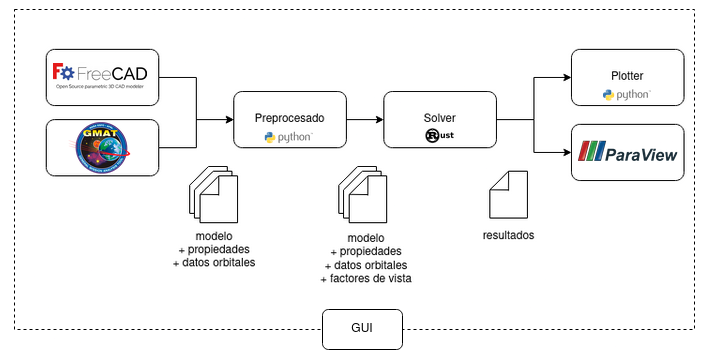

# Agni B3V

Agni B3V es una solución integral para el modelado, simulación e interpretación de los fenómenos térmicos que afectan a los satélites.

Actualmente incluye herramientas para:

* Construcción modelos tridimensionales de satélites a través de la unión de primitivas o uniendo vértices manualmente. Remallado automático para mejorar resultados de FEM. ([FreeCAD](/user_manual/freecad/freecad.md))

* Asignación de materiales y condiciones a distintas partes del modelo. ([FreeCAD Agni B3V Addon](/user_manual/freecad_addon/freecad_addon.md))

* Configuración de constantes orbitales, como ser radiación infraroja terrestre, albedo y constante solar. ([GMAT](/user_manual/gmat/gmat.md))

* Estimación de factores de vista e intercambio de energía entre elementos y entre elementos y otros cuerpos celestes. ([Preprocesador](/user_manual/preprocessor/preprocessor.md))

* Simulación térmica segundo a segundo en un intervalo y órbita especificados. ([Solver](/user_manual/solver/solver.md))

* Postprocesado e interpretación de resultados. ([Paraview](/user_manual/paraview/paraview.md), [Plotter](/user_manual/plotter/plotter.md))

  

<i> Workflow general </i>

Cada una de estas herramientas pueden ser utilizadas de manera independiente o en conjunta a través de la [Interfaz de Usuario](/user_manual/gui/gui.md).

 # Índice

La documentación se divide en las siguientes secciones:

- [📁 Manual de Usuario](../user_manual/user_manual.md)
- [📁 Manual técnico](../technical_manual/technical_manual.md)
- [📁 Benchmarks](../benchmarks/benchmarks.md)

## Consideraciones

En el estado actual del sistema solo se permiten orbitas circulares y aptitud del satélite Sun Pointing.

Se deja a discreción del usuario la verificación de la precisión de los resultados generados por el presente software por fuera de los [Benchmarks](../benchmarks/benchmarks.md), especialmente en el cálculo del albedo. Se recomienda utilizar el software con cautela.

## Autores

Este trabajo fue realizado bajo el marco del Trabajo Profesional de Ingeniería Informática de la Univesidad de Buenos Aires.

Los integrantes del equipo que realizó este proyecto son:

- Barreneche Franco
- Belinche Gianluca
- Botta Guido
- Ventura Julian
