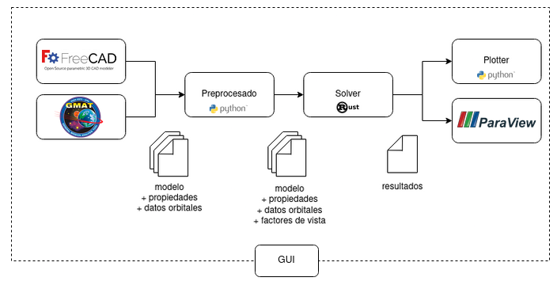

# Agni B3V

Agni B3V es un paquete de herramientas diseñado para facilitar la realización de análisis térmico satelital desde el diseño del modelo hasta la visualización de resultados. Esta documentación se encuentra conformada por las siguientes secciones:

- [📁 Manual de Usuario](../user_manual/user_manual.md)
- [📁 Manual técnico](../technical_manual/technical_manual.md)
- [📁 Benchmarks](../benchmarks/benchmarks.md)

## Workflow

El workflow recomendado para la realización del análisis térmico de principio a fin es el siguiente:

<!-- TODO: actualizar imagen, poner un recuadro que abarque todo y que diga GUI o interfaz de usuario -->

Las herramientas brindadas por Agni B3V son:

- [FreeCAD](/user_manual/freecad/freecad.md): software de código abierto de diseño asistido por computadora. Es la aplicación recomendada para el desarrollo de modelos ya que permite una fácil integración con el paquete proporcionado.
- [FreeCAD (Agni B3V Addon)](/user_manual/freecad_addon/freecad_addon.md): un addon que añade un nuevo workbench, el cual facilita la utilización de las distintas herramientas del paquete a través de la interfaz gráfica proporcionada por FreeCAD.
- [GMAT](/user_manual/gmat/gmat.md):
- [Preprocessor](/user_manual/preprocessor/preprocessor.md):
- [Solver](/user_manual/solver/solver.md): permite la realización de la simulación térmica. Puede utilizarse tanto en CPU como GPU.
- [Paraview](/user_manual/paraview/paraview.md): software de código abierto que permite la visualización de los resultados a través del tiempo en un gráfico 3D del modelo.
- [Plotter](/user_manual/plotter/plotter.md): permite visualizar los resultados en graficos de temperatura vs tiempo.

Cada una de estas herramientas pueden ser utilizadas de manera independiente o en conjunta a través de la [Interfaz de Usuario](/user_manual/gui/gui.md).

## Consideraciones

En el estado actual del sistema solo se permiten orbitas circulares y aptitud del satélite Sun Pointing.

Se deja a discreción del usuario la verificación de la precisión de los resultados generados por el presente software por fuera de los [Benchmarks](../benchmarks/benchmarks.md), especialmente en el cálculo del albedo. Se recomienda utilizar el software con cautela.

## Autores

Este trabajo fue realizado bajo el marco del Trabajo Profesional de Ingeniería Informática de la Univesidad de Buenos Aires.

Los integrantes del equipo que realizó este proyecto son:

- Barreneche Franco
- Belinche Gianluca
- Botta Guido
- Ventura Julian
