## Parte I: Conducción con PrePoMax

A continuación se detallan las pruebas realizadas para modelos con conducción y flujos fijos, comparándolos con los resultados obtenidos, para los mismos modelos, en el software de simulación térmica PrePoMax.

Los modelos de las siguientes pruebas tienen en común las siguientes propiedades:

- Fenómenos de radiación desactivados:
  - Entre elementos
  - Perdida al espacio
  - Proveniente del sol
  - Proveniente de la tierra
- Thickness de \\(1 \ mm\\)

### Prueba 1: Conducción simple en cubo

Se modeló un cubo con las siguientes características:

- Tamaño de \\(1 \ m \times 1 \ m \times 1 \ m\\)
- Material aluminio, con:
  - Densidad de \\(2700 \frac{kg}{m^3}\\)
  - Calor específico de \\(900 \frac{J}{kg \ K}\\)
  - Conductividad térmica de \\(237 \frac{W}{K \ m}\\)
- Una cara con temperatura inicial de \\(300^\circ C\\), el resto con temperatura inicial de \\(0^\circ C\\)
- Sin flujos

#### Resultados PrePoMax

Se obtuvieron los siguientes resultados tras simular con PrePoMax:

 

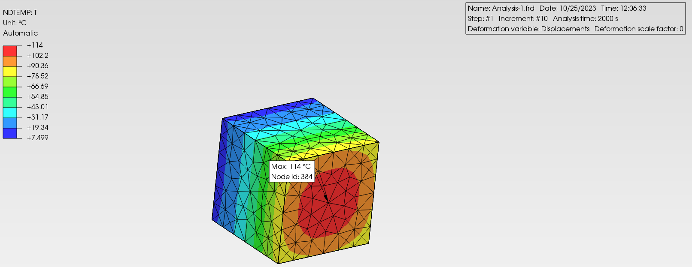

Luego de 2000 segundos de simulación las temperaturas varían entre \\(7.5^\circ C\\) y \\(114^\circ C\\)

 

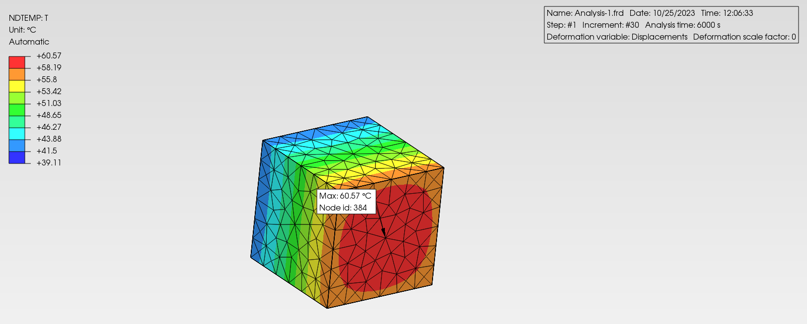

Luego de 6000 segundos de simulación las temperaturas varían entre \\(39.11^\circ C\\) y \\(60.57^\circ C\\)

 

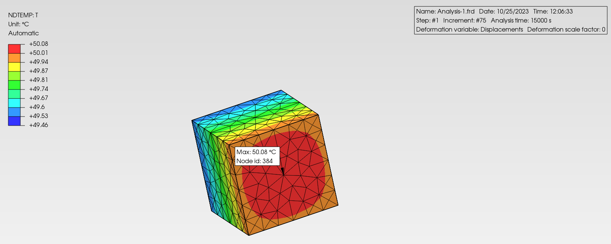

Luego de 15000 segundos de simulación se llegó a una temperatura estable entre \\(49.46^\circ C\\) y \\(50.08^\circ C\\)

#### Resultados Solver

Se obtuvieron los siguientes resultados tras simular con el solver de Agni:

 

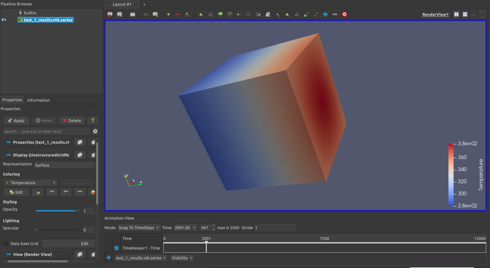

Luego de 2000 segundos, las temperaturas varían entre \\(280^\circ K \ (7^\circ C)\\) y \\(382^\circ K \ (109^\circ C)\\)

 

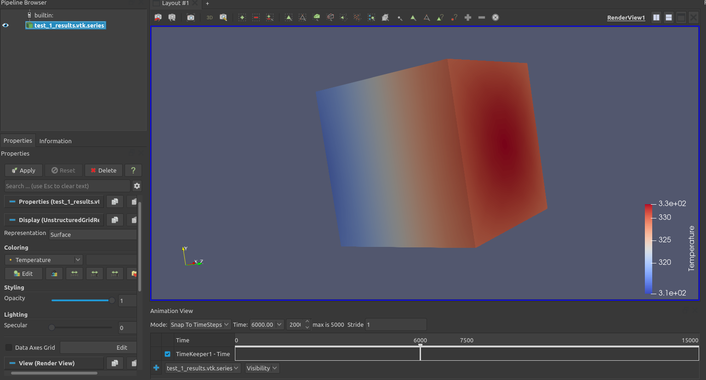

Luego de 6000 segundos, las temperaturas varían entre \\(314^\circ K \ (41^\circ C)\\) y \\(332^\circ K \ (59^\circ C)\\)

 

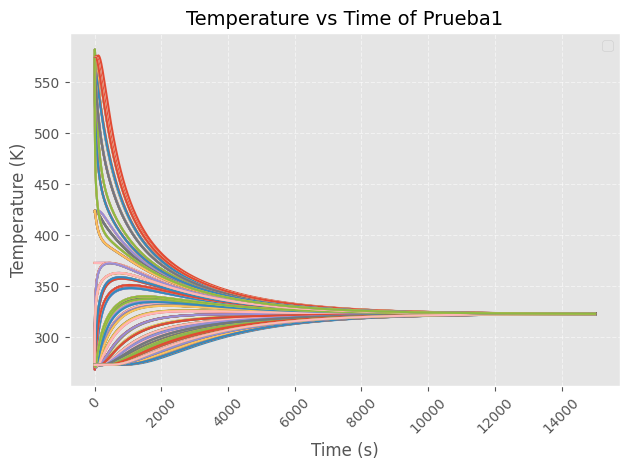

Se puede observar que a los 15000 segundos, se llega al mismo resultado de \\(323^\circ K \ (50^\circ C)\\)

 

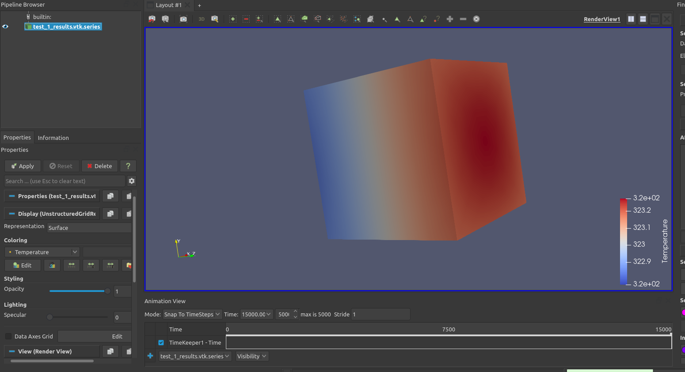

Se observa la misma temperatura en ParaView.

 

**Conclusiones**:

La energía adicional de la cara caliente se distribuye con el paso del tiempo, logrando así una temperatura final estable.
Los resultados obtenidos por ambos softwares son razonablemente cercanos.

### Prueba 2: Conducción en cubo con flujo constante

Se modeló un cubo de 1 m x 1 m x 1 m, cuyo material fue aluminio, con densidad de //(2700 \frac{kg}{m^3}//) , calor específico //(900 \frac{J}{kg.K}//)  y conductividad térmica de //(237 \frac{W}{K.m}//) .

Las caras tienen una temperatura inicial de 0 C.

Todo el cubo tiene un flujo constante de //(200 \frac{W}{m^2}//)

Resultados PrePoMax:

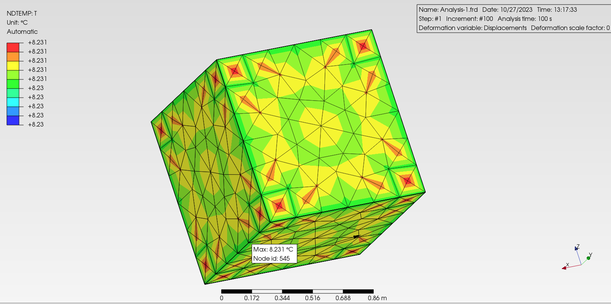

Luego de 100 segundos la temperatura es 8.23 C

Luego de 200 segundos, la temperatura en todo el cubo es de 16.46 C

Prueba Teórica:

El cambio de temperatura dado un flujo en Joules se da de acuerdo a la siguiente ecuación

//(q = m c \Delta T//)

Para el caso de una de las caras del cubo:

//( m = p V = 2700 \frac{kg}{m^3} _ 1 m _ 1 m \* 0.001 m = 2.7 kg //)

//(c = 900 \frac{J}{kg K}//)

//(Q = 200 \frac{W}{m^2} -> q = Q _ A _ t = 200 \frac{J}{s m^2} _ 1 m^2 _ 200 s = 40000 J//)

A = Área de la cara

t = tiempo

Por lo tanto el cambio de temperatura luego de 200 segundos es:

//(\Delta T = \frac{q}{m c} = \frac{40000}{2.7 \* 900} = 16.46 K//)

Resultados Solver:

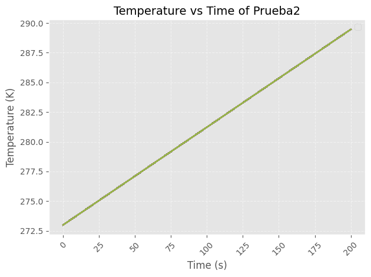

Luego de 200 segundos de simulación, se llega a una temperatura de 289.46 K (16.46 C)

Y se puede observar que el cambio es lineal, por lo que también coinciden en los demás instantes.

Conclusiones:

Como el cubo tiene la misma temperatura y el flujo es constante, la temperatura aumenta de manera lineal con el tiempo.

### Prueba 3: Conducción simple en cubo de dos materiales

Se modeló un cubo de 1 m x 1 m x 1 m

Una de las caras tiene como material cobre, con densidad //(8960 \frac{kg}{m^3}//) , calor específico //(385 \frac{J}{kg.K}//)  y conductividad térmica //(400 \frac{W}{K.m}//) .

El resto de las caras tienen de material roble, con densidad de //(700 \frac{kg}{m^3}//) , calor específico //(2300 \frac{J}{kg.K}//)  y conductividad térmica de //(400 \frac{W}{K.m}//) .

La temperatura inicial de la cara de cobre es 300 C y la de las caras de roble 0 C.

No hay flujos.

Resultados PrePoMax:

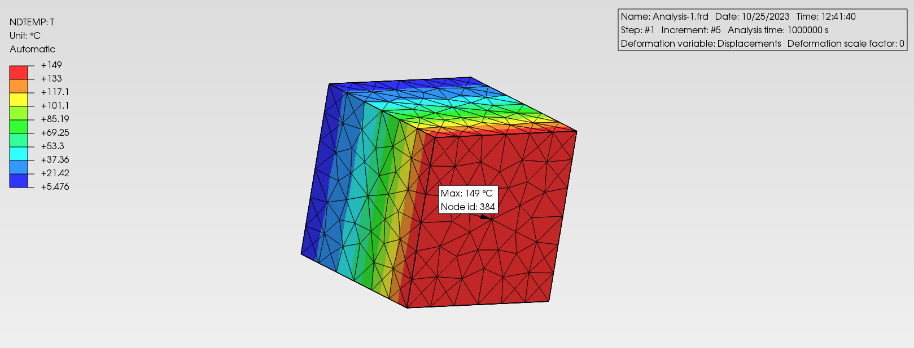

Luego de 1000000 segundos (11 días) de simulación la temperatura se encuentra entre 5.4 C y 149 C

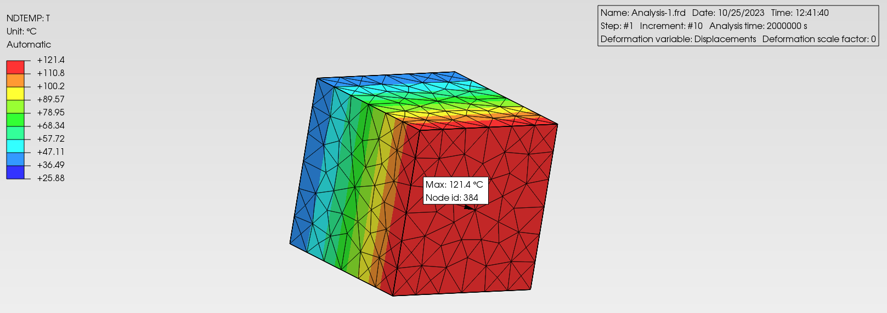

Luego de 2000000 segundos (23 días) de simulación la temperatura se encuentra entre 25.88 C y 121.4 C

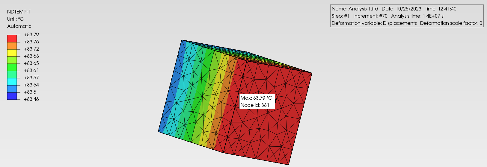

Luego de 20000000 segundos (231 días) de simulación se llegó a una temperatura estable entre 83.46 C y 83.79 C

Resultados Solver:

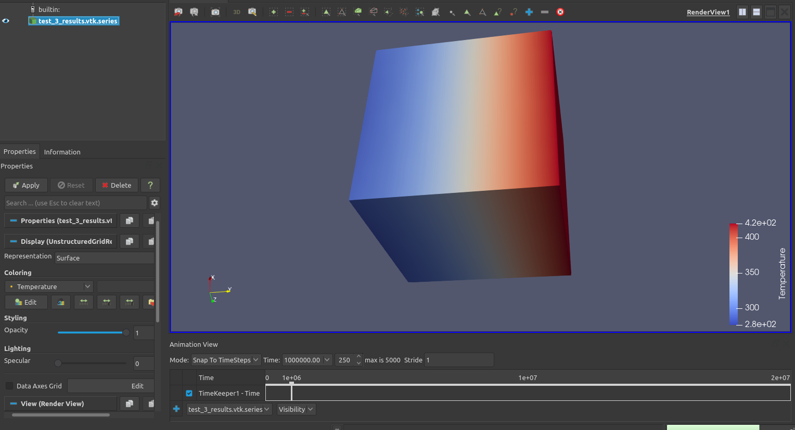

Luego de 1000000 de segundos, la temperatura está entre 277 K (4 C) y 419 K (146 C)

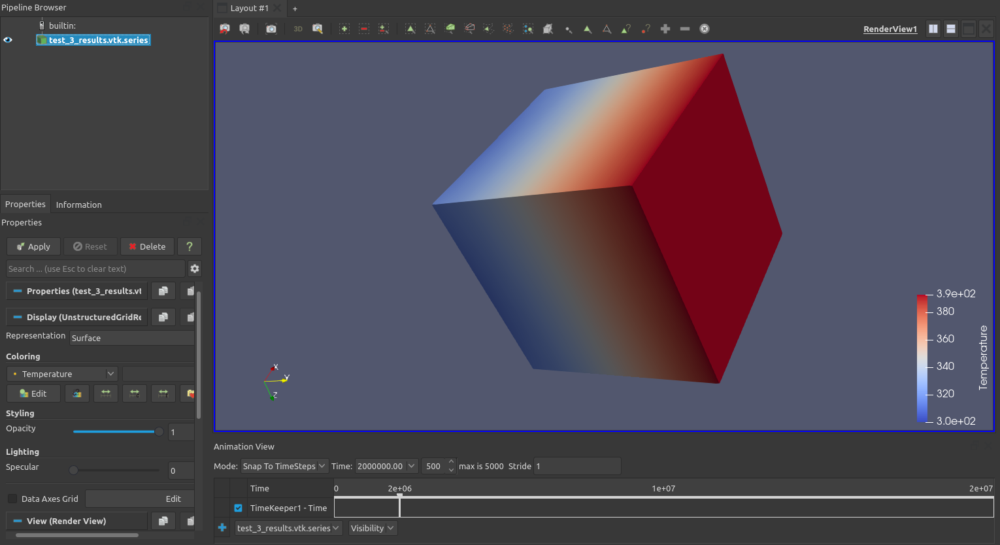

Luego de 2000000 segundos, la temperatura se encuentra entre 300 K (27 C) y 392 K (119 C)

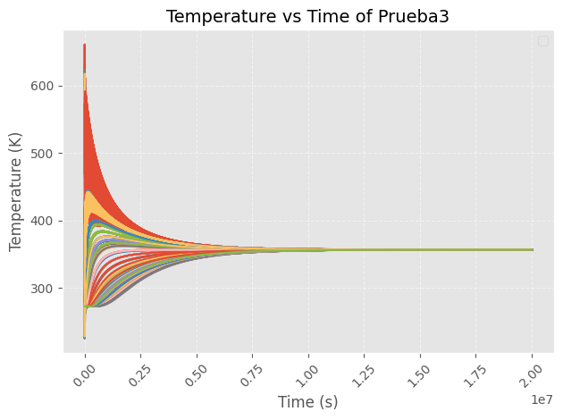

Se puede observar que a los 20000000 de segundos se estabilizó en la misma temperatura de 356.9 K (83.9 C)

Se puede observar en paraview también la misma temperatura

Conclusiones:

Como el roble es un material con muy poca conductividad térmica, el sistema tarda mucho tiempo en converger a una temperatura estable.

### Prueba 4: Cubo / Aluminio y Cobre / 0 C y 300 C / 0 W/m^2

Se modeló un cubo de 1 m x 1 m x 1 m

Una de las caras tiene como material cobre, con densidad //(8960 \frac{kg}{m^3}//) , calor específico //(385 \frac{J}{kg.K}//)  y conductividad térmica //(400 \frac{W}{K.m}//) .

El resto de las caras tienen de material aluminio, con densidad de //(2700 \frac{kg}{m^3}//) , calor específico //(900 \frac{J}{kg.K}//)  y conductividad térmica de //(237 \frac{W}{K.m}//) .

La temperatura inicial de la cara de cobre es 300 C y la de las caras de aluminio 0 C.

No hay flujos.

Resultados PrePoMax:

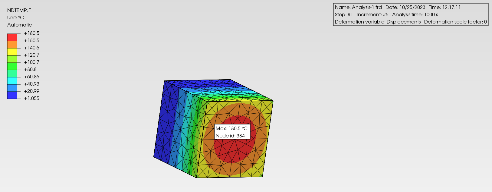

Luego de 1000 segundos de simulación, se llegó a una temperatura entre 1.055 C y 180.5 C

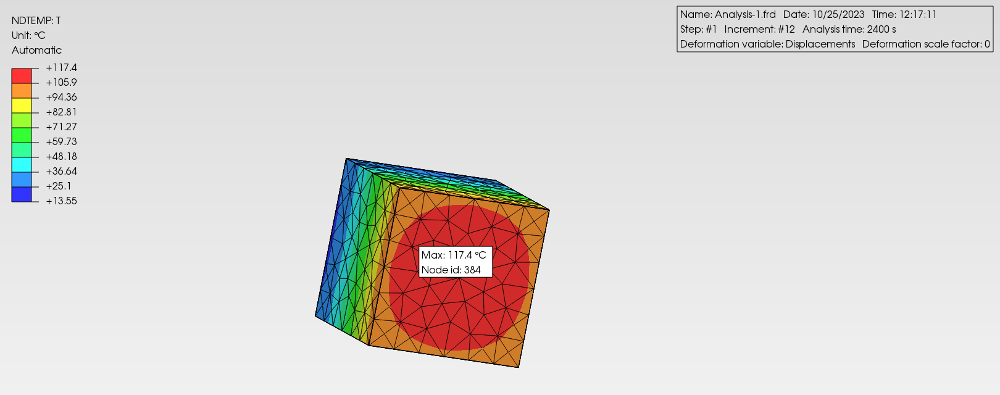

Luego de 2400 segundos de simulación, se llegó a una temperatura entre 13.55 C y 117.4 C

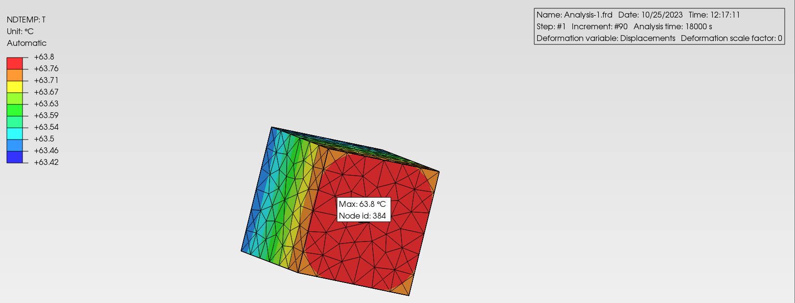

Luego de 18000 segundos de simulación, se llegó a una temperatura estable entre 63.42 C y 63.8 C

Resultados Solver:

Luego de 1000 segundos de simulación, se llegó a una temperatura entre 274 K (1 C) y 445 K (172 C)

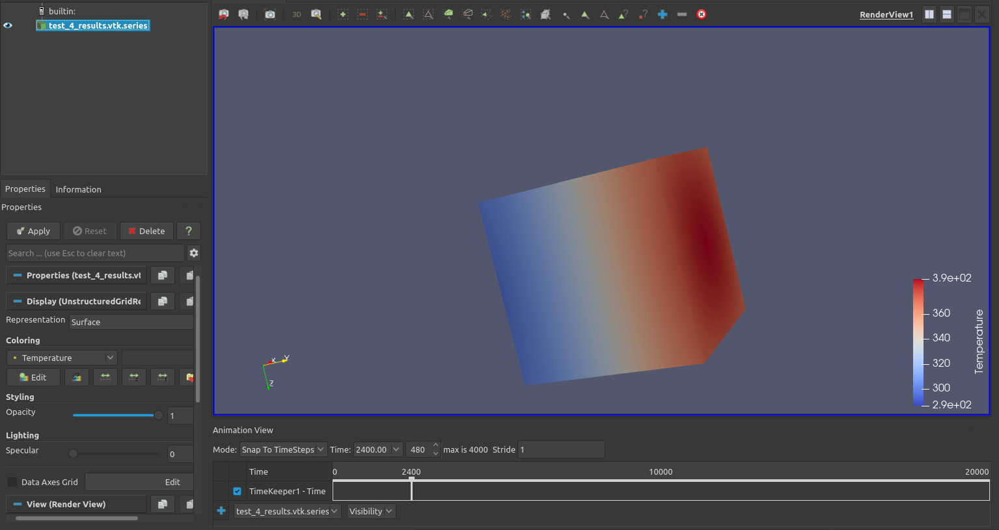

Luego de 2400 segundos de simulación, se llegó a una temperatura entre 287 K (14 C) y 387 K (114 C)

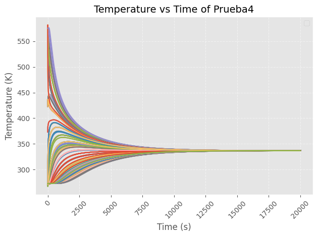

Se puede observar que a los 18000 de segundos se estabilizó en la misma temperatura de 336.6 K (63.6 C)

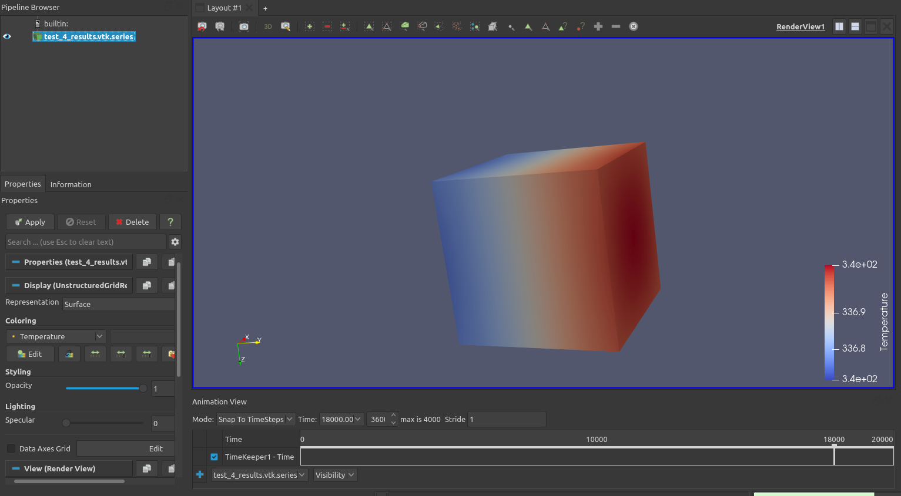

Se puede observar en paraview también la misma temperatura

Conclusiones:

Como la temperatura del cobre era mayor, se transmitió la temperatura al aluminio y se consiguió una temperatura estable, cabe destacar que si lo comparamos con el caso 1 donde las condiciones eran las mismas excepto por los materiales, la temperatura final obtenida es distinta.

### Prueba 5: Cubo / Roble y Cobre / 0 C / 100 W/m^2

Se modeló un cubo de 1 m x 1 m x 1 m

Una de las caras tiene como material cobre, con densidad //(8960 \frac{kg}{m^3}//) , calor específico //(385 \frac{J}{kg.K}//)  y conductividad térmica //(400 \frac{W}{K.m}//) .

El resto de las caras tienen de material roble, con densidad de //(700 \frac{kg}{m^3}//) , calor específico //(2300 \frac{J}{kg.K}//)  y conductividad térmica de //(400 \frac{W}{K.m}//) .

La temperatura inicial es de 0 C para todo el cubo.

Hay flujo constante de //(100 \frac{W}{m^2}//) para todo el cubo.

Resultados PrePoMax:

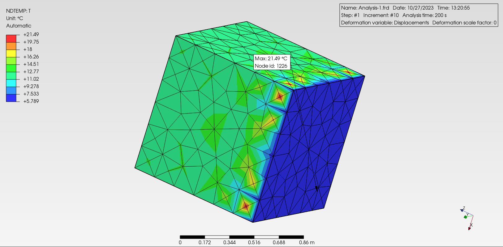

Luego de 200 segundos de simulación, la cara de cobre tiene una temperatura de 5.78 C, mientras que el roble tiene una temperatura de aproximadamente 11.89 C.

Luego de 1000 segundos de simulación, la cara de cobre tiene una temperatura de 29.63 C, mientras que el roble tiene una temperatura de aproximadamente 62.69 C.

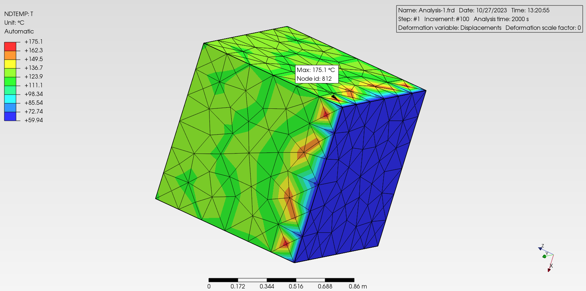

Luego de 2000 segundos de simulación, la cara de cobre tiene una temperatura de 59.94 C, mientras que el roble tiene una temperatura de aproximadamente 123.9 C.

Resultados Solver:

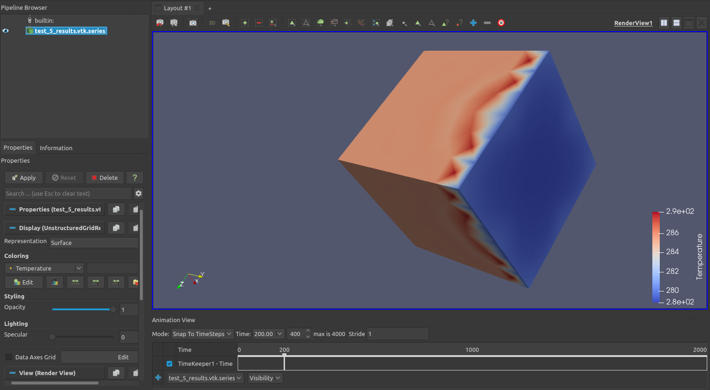

Luego de 200 segundos de simulación, la cara de cobre tiene una temperatura de  279 K (6 C), mientras que las de roble de  285 K (12 C)

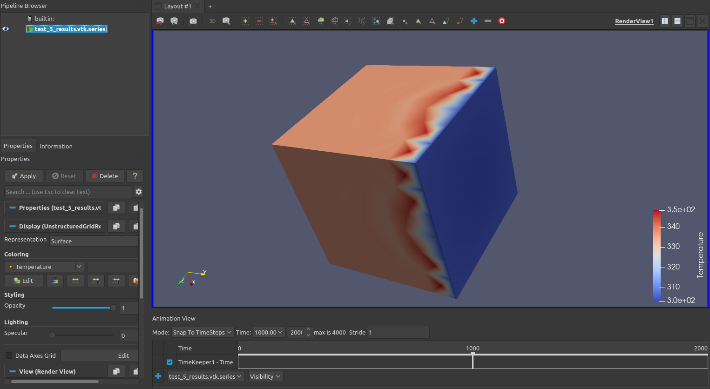

Luego de 1000 segundos de simulación, la cara de cobre tiene una temperatura de 304 K (31 C), mientras que las de roble de 335 K (62 C)

Luego de 2000 segundos de simulación, la cara de cobre tiene una temperatura de 335 K (62 C), mientras que las de roble de 397 K (124 C)

Se puede observar como en el borde la cara de cobre con el roble hay conducción de calor.

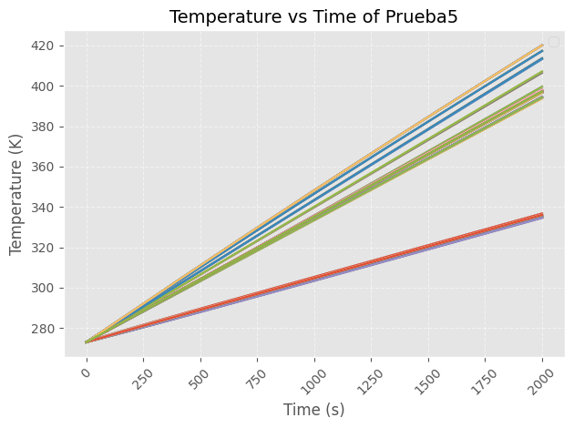

Las líneas amarillas representan el roble, las rojas el cobre, y las demás la frontera entre ambas.

Se puede observar como el roble va aumentando su temperatura más rápido que el cobre, pero la parte que más cerca del borde está, se va enfriando.

Prueba Teórica:

Al igual que con la Prueba 2, se puede calcular cuanto seria el cambio de temperatura de una de las caras del cubo a partir del flujo que reciben.

Para la cara de cobre, a los 200 segundos tenemos:

//(\Delta T = \frac{q}{m c} = \frac{Q A t}{V p c} = \frac{100 _ 1 _ 200}{0.001 _ 8960 _ 385} = 5.79 K//)

Que es efectivamente el cambio de temperatura a los 200 segundos.

Para 2000 segundos, el cambio de temperatura debería ser 57.9, sin embargo esta es 59.94, esto se explica ya que como también está el roble cuya temperatura es mayor, hay conducción por lo que aumenta la temperatura del cobre.

Conclusión:

Más allá de haber empezado a la misma temperatura, como el roble y el cobre tienen constantes térmicas diferentes, el cambio de temperatura dado un flujo no es igual para ambos, por lo que el cambio de temperatura es distinto en ambos materiales, y teniendo en cuenta los resultados de la prueba 4, el tiempo necesario para que se estabilicen las temperaturas por conducción es mucho mayor, por lo que nunca se llega a una estabilidad.

Tiene sentido que el cambio de temperatura sea mayor en el roble, ya que la densidad de éste es menor, por lo que la masa es menor, lo cual hace que el cambio de temperatura sea mayor (aunque el calor específico sea mayor y haga que el cambio de temperatura sea menor, no es lo suficiente para contrarrestar el peso de la densidad)

## Parte 2: Radiación

A continuación se compararán pruebas teóricas realizadas para modelos en los que solo hay radiación entre elementos, es decir, no habrá conducción, ni radiación recibida por el sol o la tierra.

### Prueba 1: Placas paralelas

En esta prueba la idea es calcular de manera teórica la transferencia de calor por radiación de dos placas infinitas paralelas, y aproximarlas haciendo un modelo de dos placas muy grandes y muy cerca.

Además se tomarán los factores de vista directos entre las superficies por su mayor facilidad de cálculo, para que los resultados sean comparables, también se toman estos en la simulación.

Se modelaron dos placas de 1000 m x 1000 m con grosor de 0.001 m, a una distancia de 0.1 m

Densidad = //(2700 \frac{kg}{m^3}//) , Calor específico = //(897 \frac{J}{kg.K}//)

Emisividad = 1

Temperatura inicial placa 1 = 500 K

Temperatura inicial placa 2 = 300 K

Prueba Teórica:

El flujo de calor para una de las placas será:

//(q*{Total1} = q*{Gain1} - q\_{Lost1}//)

//(q\_{Lost1} = e_1 \sigma T_1^4//)

//(q*{Gain1} = F*{21} e_1 e_2 \sigma T_2^4//)

El de la otra placa:

//(q*{Total2} = q*{Gain2} - q\_{Lost2}//)

//(q\_{Lost2} = e_2 \sigma T_2^4//)

//(q*{Gain2} = F*{12} e_1 e_2 \sigma T_1^4//)

Siendo:

//(e_1//) = Emisividad de la placa 1

//(e_2//) = Emisividad de la placa 2

//(F\_{21}//) = Factor de vista de 2 a 1

//(F\_{12}//) = Factor de vista de 1 a 2

Luego una vez obtenidos los q para cada placa, se puede calcular la variación de temperatura de la siguiente manera:

//(\Delta T = \frac{Q}{m c}//)

Siendo Q el calor en joules obtenido, m la masa en kg y c el calor específico

Por lo que si tomamos una cantidad de tiempo t transcurrido, obtenemos que

//(\Delta T = \frac{Q}{m c} = \frac{q _ A _ t}{densidad _ a _ th \* c}//)

A = Área

th = Thickness

Para el caso particular de esta prueba tenemos que:

//(q\_{Lost1} = 5.6 _ 10^{-8} _ 500^4 = 3500 \frac{W}{m^2}//)

//(q\_{Gain1} = 0.5 _ 5.6 _ 10^{-8} \* 300^4 = 226.8 \frac{W}{m^2}//)

//(q\_{Lost2} = 5.6 _ 10^{-8} _ 300^4 = 453.6 \frac{W}{m^2}//)

//(q\_{Gain2} = 0.5 _ 5.6 _ 10^{-8} \* 500^4 = 1750 \frac{W}{m^2}//)

//(q*{Total1} = q*{Gain1} - q\_{Lost1} = -3273.2 \frac{W}{m^2}//)

//(q*{Total2} = q*{Gain2} - q\_{Lost2} = 1296.4 \frac{W}{m^2}//)

Si pasaron 10 segundos:

//(\Delta T*1 = \frac{q*{Total1} _ A _ t}{densidad _ a _ th _ c} = \frac{-3273.2 _ 10}{2700 _ 0.001 _ 897} = -13.51 K//)

//(\Delta T*2 = \frac{q*{Total2} _ A _ t}{densidad _ a _ th _ c} = \frac{1750 _ 10}{2700 _ 0.001 _ 897} = 7.22 K//)

Por lo que las nuevas temperaturas serían:

//(T_1 = 500 - 13.51 = 486.49 K//)
//(T_2 = 300 + 7.22 = 307.22 K//)

Resultados Solver:

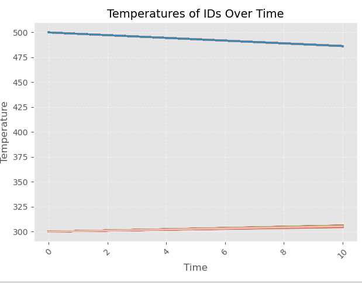

Luego de 10 segundos de simulación, el plano de temperatura 500 K paso a una temperatura de 486.4 K, mientras que el plano de 300 K paso a una temperatura de 305.2 K

Por lo que las temperaturas dan bastante similar, y se puede entender la leve diferencia del segundo plano ya que en realidad no son infinitos por lo que tiene sentido que pierda un poco más de temperatura por los bordes

### Prueba 2: Placas paralelas distinta emisividad

Igual que la Prueba 1, pero esta vez

Emisividad1 = 0.7

Emisividad2 = 1

Prueba Teórica:

//(q*{Lost1} = e_1 \sigma T_1^4 = 0.7 * 5.6 _ 10^{-8} \* 500^4 = 2450 \frac{W}{m^2}//)
//(q_{Gain1} = F\_{21} e*1 e_2 \sigma T_2^4 = 0.5 * 0.7 _ 5.6 _ 10^{-8} \_ 300^4 = 158.76 \frac{W}{m^2}//)

//(q\_{Lost2} = e*2 \sigma T_2^4 = 5.6 * 10^{-8} \_ 300^4 = 453.6 \frac{W}{m^2}//)

//(q*{Gain2} = F*{12} e*1 e_2 \sigma T_1^4 = 0.5 * 0.7 _ 5.6 _ 10^{-8} \_ 500^4 = 1225 \frac{W}{m^2}//)

//(q*{Total1} = q*{Gain1} - q\_{Lost1} = -2291.24 \frac{W}{m^2}//)

//(q*{Total2} = q*{Gain2} - q\_{Lost2} = 771.4 \frac{W}{m^2}//)

Si pasaron 10 segundos:

//(\Delta T*1 = \frac{q*{Total1} _ A _ t}{densidad _ a _ th _ c} = \frac{-2291.4 _ 10}{2700 _ 0.001 _ 897} = -9.46 K//)

//(\Delta T*2 = \frac{q*{Total2} _ A _ t}{densidad _ a _ th _ c} = \frac{771.4 _ 10}{2700 _ 0.001 _ 897} = 3.18 K//)

Por lo que las nuevas temperaturas serían:

//(T_1 = 500 - 9.46 = 490.54 K//)

//(T_2 = 300 + 3.18 = 303.18 K//)

Resultados Solver:

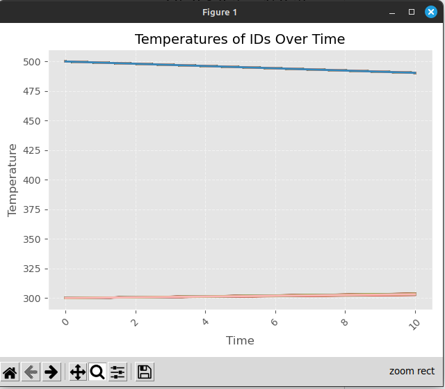

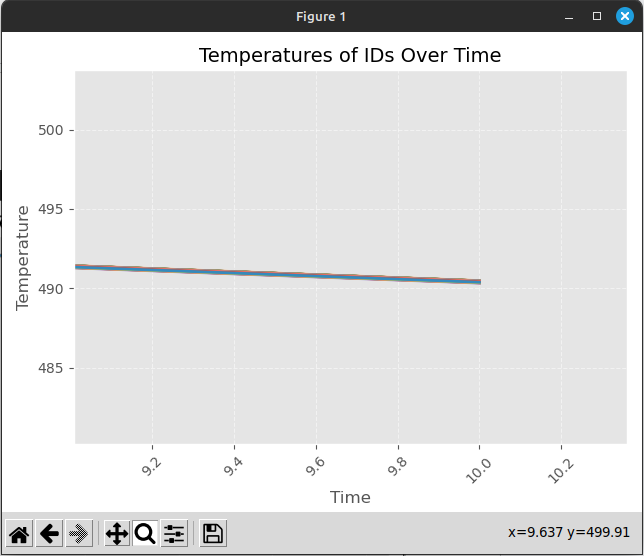

Luego de 10 segundos de simulación la temperatura de la placa a 500 K pasó a ser 490.49 K

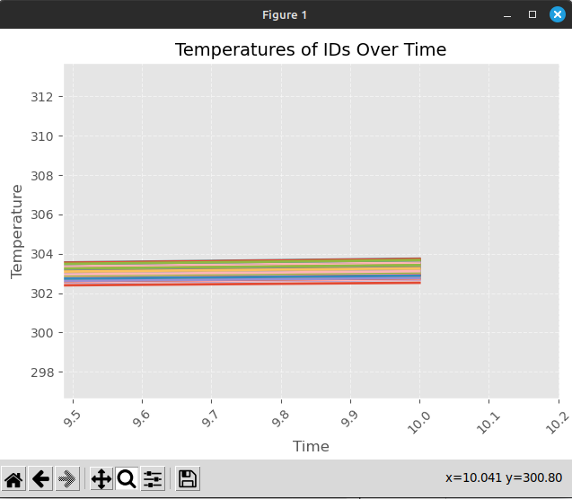

Mientras que la temperatura de la placa a 300 K pasó a ser 303.4 K

Igual que el ejemplo anterior, la temperatura de la placa mas fria difiere levemente en resultado

### Prueba 3: Placas paralelas distinta emisividad 2

Igual que la Prueba 1, pero esta vez

Emisividad1 = 0.7

Emisividad2 = 0.2

Prueba Teórica:

//(q*{Lost1} = e_1 \sigma T_1^4 = 0.7 * 5.6 _ 10^{-8} \* 500^4 = 2450 \frac{W}{m^2}//)
//(q_{Gain1} = F\_{21} e*1 e_2 \sigma T_2^4 = 0.5 * 0.7 _ 0.2 _ 5.6 \_ 10^{-8} \* 300^4 = 31.75 \frac{W}{m^2}//)

//(q\_{Lost2} = e*2 \sigma T_2^4 = 0.2 * 5.6 \_ 10^{-8} \* 300^4 = 90.72 \frac{W}{m^2}//)

//(q*{Gain2} = F*{12} e*1 e_2 \sigma T_1^4 = 0.5 * 0.2 _ 0.7 _ 5.6 \_ 10^{-8} \* 500^4 = 245 \frac{W}{m^2}//)

//(q*{Total1} = q*{Gain1} - q\_{Lost1} = -2418.25 \frac{W}{m^2}//)

//(q*{Total2} = q*{Gain2} - q\_{Lost2} = 154.28 \frac{W}{m^2}//)

Si pasaron 10 segundos:

//(\Delta T*1 = \frac{q*{Total1} _ A _ t}{densidad _ a _ th _ c} = \frac{-2418.25 _ 10}{2700 _ 0.001 _ 897} = -9.98 K//)

//(\Delta T*2 = \frac{q*{Total2} _ A _ t}{densidad _ a _ th _ c} = \frac{154.28 _ 10}{2700 _ 0.001 _ 897} = 0.63 K//)

Por lo que las nuevas temperaturas serían:

//(T_1 = 500 - 9.98 = 490.02 K//)

//(T_2 = 300 + 0.63 = 300.63 K//)

Resultados Solver:

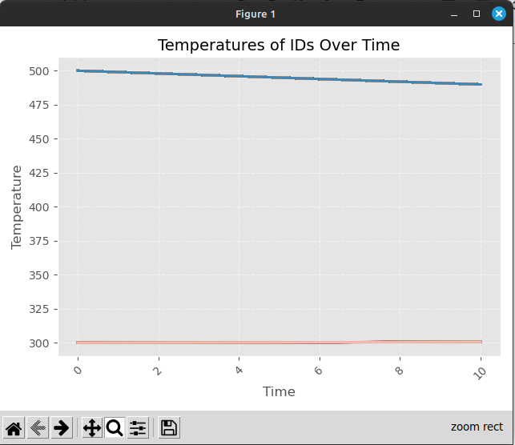

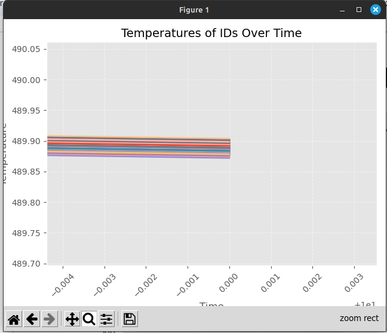

Luego de 10 segundos, la placa de 500 K esta a una temperatura de 489.9 K

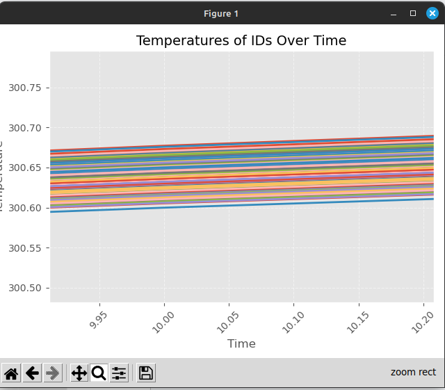

Luego de 10 segundos, la placa de 300 K esta a una temperatura de 300.65 K

Al igual que con las pruebas anteriores se observa una leve diferencia en la placa más fría.

## Parte III: Conservación de la Energía

Se realizaron calculos de conservación de la energia de la siguiente manera:

Para cada instante de tiempo, se calculo la energia del sistema como la sumatoria para cada nodo de:

\\(E = T _ c _ p _ th _ a\\)

Siendo

- T temperatura del nodo

- c calor especifico

- p densidad

- th grosor

- a area del nodo

El area del nodo se calcula como la sumatoria de las areas de los elementos a los que pertenece el nodo, divido 3, dividido la cantidad de elementos a los que pertenece.

Luego se realiza la resta de las energias entre instantes consecutivos para obtener la diferencia de energias.

A esto se le suma el flujo (entrante y saliente) entre esos instantes para cada nodo.

Se obtuvo el siguiente resultado:

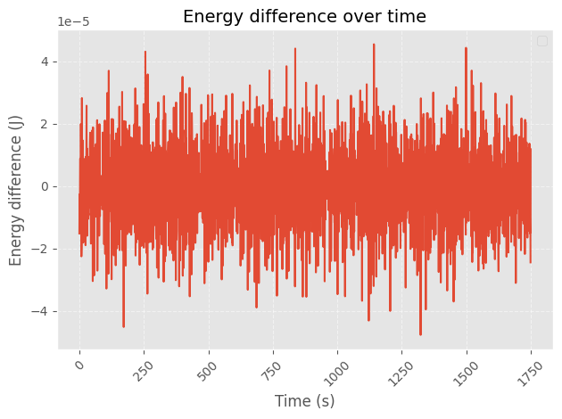

Se puede observar que se conserva la energia a lo largo de la simulación.

## Parte IV: Convergencia

Se realizaron simulaciones en distintas condiciones de mesh y time_step del siguiente modelo:

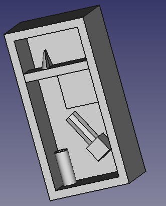 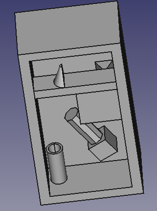 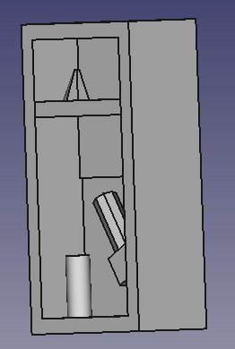

Se tomaron los siguientes puntos para las comparaciones:

Centro del panel:

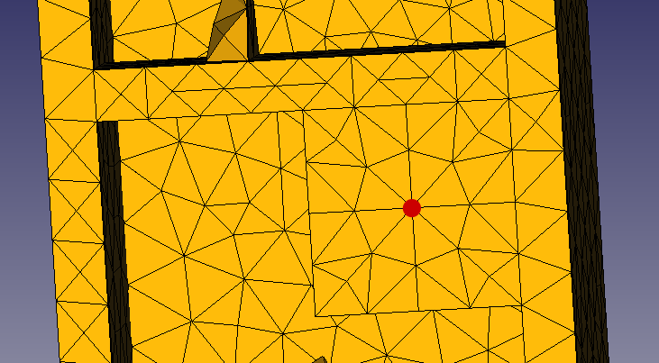

Piramide oculta:

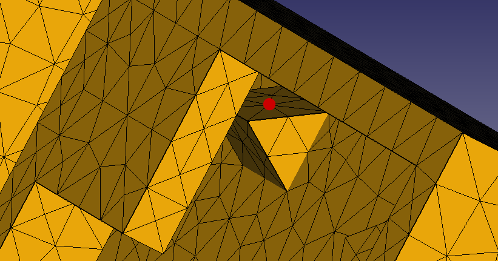

Cara Interior:

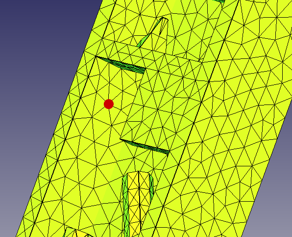

### Convergencia en tiempo

Se realizaron simulaciones con time_steps de 1, 10 y 100 segundos

Los resultados obtenidos fueron los siguientes:

Centro del panel:

Piramide oculta:

Cara Interior:

El error relativo comparando con la simulación de time_step 1 segundo fue el siguiente (0 sin error, 1 100% de error):

Centro del panel:

Piramide oculta:

Cara Interior:

La desviación estandar comparando con la simulación de time_step 1 segundo fue la siguiente:

Centro del panel:

Piramide oculta:

Cara Interior:

### Convergencia en malla

Se realizaron simulaciones con mallas de 622, 1178, 2841 y 5539 elementos.

Los resultados obtenidos fueron los siguientes:

Centro del panel:

Piramide oculta:

Cara Interior:

El error relativo comparando con la simulación de 5539 elementos fue el siguiente (0 sin error, 1 100% de error):

Centro del panel:

Piramide oculta:

Cara Interior:

La desviación estandar comparando con la simulación de 5539 elementos fue la siguiente:

Centro del panel:

Piramide oculta:

Cara Interior:

