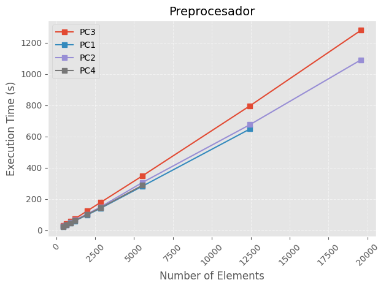
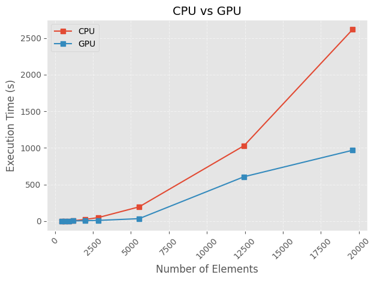

A continuación se detallarán las distintas pruebas realizadas comparando los tiempos de ejecución de las distintas partes del software en distintas computadoras.

Se utilizaron 4 computadoras con distintos componentes:

PC1:
- Procesador: AMD Ryzen 5 5600 G
- Tarjeta Grafica: AMD Radeon RX 6650 XT
- Memoria RAM: 16 GB

PC2:
- Procesador: AMD Ryzen 9 3900X 12-Core Processor 3.79 GHz
- Tarjeta Grafica: AMD Radeon RX 5600 XT
- Memoria RAM: 16 GB

PC3:
- Procesador: Intel i7 8700
- Tarjeta Grafica: Nvidia GTX 1080 Ti
- Memoria RAM: 16 GB 2400 Mhz

PC4:
- Procesador: Intel Core i7-9700F 3.00 GHz
- Tarjeta Grafica: Nvidia GT 730
- Memoria RAM: 16 GB

## Preprocesador

Los tiempos de ejecución del preprocesador fueron los siguientes:

## Solver CPU

Los tiempos de ejecución del solver en CPU fueron los siguientes:

## Solver GPU

Los tiempos de ejecución del solver en GPU fueron los siguientes:

## Total CPU

Los tiempos de ejecución totales en CPU fueron los siguientes:

## Total GPU

Los tiempos de ejecución totales en GPU fueron los siguientes:

## CPU vs GPU

Se muestra una comparación del tiempo de ejecución del solver en CPU vs GPU para la PC3

