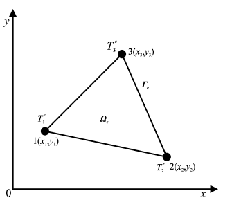
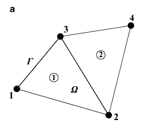
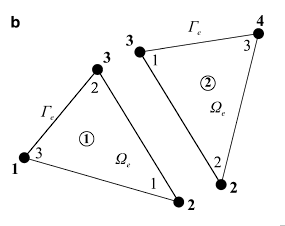
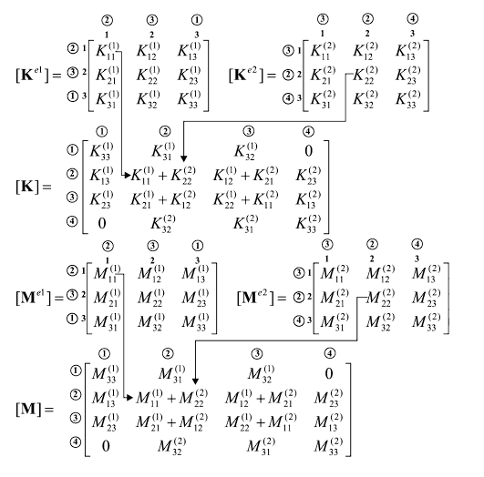
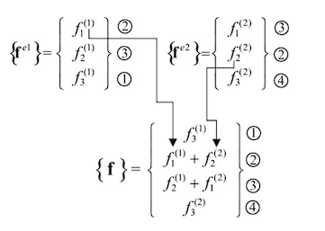

# Modelo FEM

## Ecuación de Calor

Para resolver el problema de transferencia de calor se utilizó el método numérico de elementos finitos (FEM).
Este método consiste en discretizar las superficies del dominio del problema a simular en elementos, cada uno de los cuales está compuesto por vértices o nodos de cómputo. El número de nodos por elemento dependerá de la forma de éste, pudiendo utilizar elementos rectangulares o triangulares. El desarrollo fue realizado utilizando estos últimos.

A continuación se presentará un resumen del método empleado. Para mas información sobre el desarrollo matématico referirse al paper [Finite Element Method in Steady-State and Transient Heat Conduction](https://www.researchgate.net/publication/274399522_Finite_Element_Method_in_Steady-State_and_Transient_Heat_Conduction).

Se comienza planteando la ecuación que gobierna la transferencia de calor en dos dimensiones:
  

\\[
c p \frac {\partial T}{\partial t} =
\frac {\partial }{\partial x} (k_x\frac {\partial T}{\partial x}) +
\frac {\partial }{\partial y} (k_y\frac {\partial T}{\partial y}) +
q_v
\\]

Donde:

- \\(c\\) es el calor específico del material.
- \\(p\\) la densidad del material.
- \\(k_x\\) y \\(k_y\\) las conductividades térmicas del material en cada componente.

Esta ecuación se encuentra sujeta a tres tipos de condiciones de contorno:

- Dirichlet: Temperatura conocida en una región.
- Neumann: Flujo de calor conocido en una región.
- Combinación Dirichlet y Neumann: Calor recibido debido a flujo de convección y temperatura ambiente conocidos en una región.

Debido a que el fenómeno de transmisión de calor por convección no se encuentra presente en el dominio del problema, la tercer condición es descartada.
Adicionalmente, con el objetivo de simplificar el desarrollo del modelo, las primeras dos condiciones también son descartadas. Más adelante se detallará como se logró obtener el mismo efecto de la condición de Neumann por otro medio.

Y, por último, la condición inicial necesaria para resolver es:
  

\\[T(x,y,t)|\_{t=0} = T_0(x,y)\\]

## Representación Matricial

Tras desarrollar la ecuación presentada, aplicando las condiciones y discretización en elementos, se obtiene la siguiente ecuación:
  

\\[ [M^e] \{\frac {d T^e}{dt}\} + [K^e] \{ T^e \} = \{ f^e\}\\]

Donde:

- \\( [M^e] \\) es la matriz de capacitancias.
- \\([K^e]\\) es la matriz de conductividad.
- \\(\{ f^e\}\\) es el vector de flujos.

Esta ecuación matricial es conocida como la representación de Galerkin de la ecuación de transmisión de calor transitoria. Si las propiedades físicas \\(k, \rho, c\\) son independientes de la temperatura, entonces la misma puede ser resuelta utilizando métodos de resolución de sistemas de ecuaciones lineales.
Las matrices que participan en esta ecuación hacen referencia a un único elemento de todo el dominio. A estas se las conoce como matrices locales.

### Construcción de matrices locales

Las matrices locales antes presentadas son construidas de la siguiente forma:

Dado un elemento genérico

  

Tomando como hipótesis que la conductividad térmica del material es isotrópica (\\(k_x = k_y = k\\)). Es decir, los materiales poseen la misma conductividad en ambas direcciones. Y considerando que \\(A^e\\) es el area del elemento.

La matriz de conductividad del elemento \\([K_c^e]\\), tiene la forma
  

\\[
[K_c^e] = \begin{bmatrix}
K^e_{11} & K^e_{12} & K^e_{13}\\\\
K^e_{21} & K^e_{22} & K^e_{23}\\\\
K^e_{31} & K^e_{32} & K^e_{33}
\end{bmatrix} 
\\]

Donde:

\\[
\begin{aligned}
\begin{split}
b_1 = y_2 - y_3 \\\\
b_2 = y_3 - y_1 \\\\
b_3 = y_1 - y_2
\end{split}
\quad\quad
\begin{split}
c_1 = x_3 - x_2\\\\
c_2 = x_1 - x_3\\\\
c_3 = x_2 - x_1
\end{split}
\end{aligned}
\\]

\\[
\begin{aligned}
\begin{split}
K^e_{11} &= \frac{k}{4A^e} ({b_1}^2 + {c_1}^2) \\\\
K^e_{12} &= \frac{k}{4A^e} (b_1 b_2 + c_1 c_2) \\\\
K^e_{13} &= \frac{k}{4A^e} (b_1 b_3 + c_1 c_3)
\end{split}
\quad
\begin{split}
K^e_{21} &= K^e_{12} \\\\
K^e_{22} &= \frac{k}{4A^e} (b_2^2 + c_2^2) \\\\
K^e_{23} &= \frac{k}{4A^e} (b_2 b_3 + c_2 c_3)
\end{split}
\quad
\begin{split}
K^e_{31} &= K^e_{13} \\\\
K^e_{32} &= K^e_{23} \\\\
K^e_{33} &= \frac{k}{4A^e} (b_3^2 + c_3^2)
\end{split}
\end{aligned}
\\]

 

La matriz de capacitancia del elemento \\([M^e]\\), tiene la forma
  

\\[
[M^e] = \frac{A^e}{12} c p \begin{bmatrix}
2 & 1 & 1\\\\
1 & 2 & 1\\\\
1 & 1 & 2
\end{bmatrix}
\\]
 

El vector de flujo debido a generación de calor interna \\(\{f^e\}\\), tiene la forma
  

\\[
\{f^e\} = q \frac{A^e}{3} \begin{bmatrix}
1 \\\\
1 \\\\
1
\end{bmatrix}
\\]
 

Donde \\(q\\) es el calor generado dentro del elemento.

### Construcción de matrices globales

Hasta el momento se han detallado las ecuaciones y matrices empleadas a nivel local, dentro de un único elemento. A continuación se detallará cómo es posible expandir este modelo al resto de los elementos.

Se parte de un ejemplo de un modelo con 2 elementos y 4 nodos. A cada nodo se le asignará una numeración local, que lo identifica dentro de un mismo elemento, y una numeración global, que lo identifica frente al resto de nodos del modelo.

La numeración global es la siguiente:
  

  

 
Y la numeración local:
  

  

El proceso de construcción de una matriz global consiste en utilizar los identificadores globales de los nodos de cada matriz local para agregar los resultados en la matriz global. 
De esta forma, por cada coordenada \\((x,y)\\) de identificadores locales dentro de una matriz local existirá un mapeo a una coordenada \\((u,v)\\) de identificadores globales en la matriz global.

Por tomar un ejemplo, en el elemento número 1, el nodo de identificador local 1 tiene asignado un identificador global 2. Por ende, su mapeo será \\((1, 1) \rightarrow (2, 2)\\).
  

  

 
De forma análoga es posible construir el vector de flujos global
  

  

Una vez obtenidas las matrices globales, es posible expandir la ecuación de Galerkin a su forma global.

\\[[M] \{\frac {d T}{dt}\} + [K] \{ T \} = \{ f\}\\]

Luego, si esta ecuación es discretizada en función del tiempo haciendo uso del método de Crank-Nicolson generalizado, se obtiene
  

\\[ 
(\frac{1}{\Delta t}[M] + \theta [K] ) \ \{ T \}^{n+1} = 
(\frac{1}{\Delta t}[M] - (1 - \theta) [K]) \ \{T\}^n + (1 - \theta) \{f\}^n + \theta \{f\}^{n+1} 
\\]

Eligiendo \\(\theta = 0.5\\) se obtiene el conocido esquema semi-implícito por método de Crank-Nicolson.

Adicionalmente, en pos de mantener la linealidad de la ecuación al añadir a esta los términos cuarticos referentes a radiación, se decidió hacer uso de una corrección del método tal que se eliminase su característica implícita en el vector de flujos.

En esta modificación se asume para el instante \\(n\\), que el flujo permanecerá constante en el instante siguiente. Esto es:
  

\\[
\{f\}^n = \{f\}^{n+1}
\\]

 
Por lo que la ecuación puede reescribirse de la siguiente forma:
  

\\[ 
(\frac{1}{\Delta t}[M] + \theta [K]) \ \{ T \}^{n+1} = 
(\frac{1}{\Delta t}[M] - (1 - \theta) [K]) \ \{T\}^n + \{f\}^n 
\\]

### Expansión a tres dimensiones

Todo el desarrollo hasta el momento ha sido planteado desde el punto de vista de un modelo 2D. 
A continuación se explicará como es posible seguir utilizando el mismo modelo, con pequeñas correcciones, para simular la propagación de calor sobre la superficie de objetos 3D. 
A este tipo de modelo, que no contempla transmisión a nivel volumétrico, se lo suele llamar 2.5D.

Los cambios a realizar implican incorporar un parámetro de grosor \\(G_e\\) para cada elemento (asociado a una superficie) e incrementar la dimensionalidad de los puntos del modelo de 2 a 3 coordenadas \\((x, y, z)\\).

Tras aplicar estos cambios será necesario modificar la forma en la que algunas matrices locales son construidas.

La matriz de capacitancia será multiplicada por el grosor del elemento.
  

\\[[M^e] = \frac{A^e}{12} G_e c \rho
\begin{bmatrix}
2 & 1 & 1 \\\\
1 & 2 & 1 \\\\
1 & 1 & 2
\end{bmatrix}
\\]

 
Por otro lado, la matriz conductividad también será multiplicada por el grosor del elemento, pero además verá modificada las constantes que dan lugar a su creación.

Observese que los calculos de las constantes \\(b_i\\) y \\(c_i\\) refieren a propiedades espaciales del elemento.
La operación \\(b_1^2 + c_1^2\\) no es más que la distancia al cuadrado entre el vertice 2 y el vertice 3 del elemento.
Por otro lado, la operación \\(b_1 b_2 + c_1 c_2\\) se puede interpretar como el producto escalar entre dos vectores, el primero es el que une el vertice 2 con el vertice 3, y el segundo el que une el vertice 3 con el vertice 1.

Por lo tanto, todos estos calculos pueden realizarse a partir de las coordenadas de los vertices en 3D. De esta forma, la matriz de conductividad puede ser construida de la siguiente forma:
  

\\[
[K_c^e] = \begin{bmatrix}
K^e_{11} & K^e_{12} & K^e_{13}\\\\
K^e_{21} & K^e_{22} & K^e_{23}\\\\
K^e_{31} & K^e_{32} & K^e_{33}
\end{bmatrix} 
\\]

Donde:

\\[
\begin{aligned}
\begin{split}
K^e_{11} &= G_e \frac{k}{4A^e} ||v_3 - v_2||^2 \\\\
K^e_{12} &= G_e \frac{k}{4A^e} (v_3 - v_2) \cdot (v_1 - v_3) \\\\
K^e_{13} &= G_e \frac{k}{4A^e} (v_3 - v_2) \cdot (v_2 - v_1)
\end{split}
\quad
\begin{split}
K^e_{21} &= K^e_{12} \\\\
K^e_{22} &= G_e \frac{k}{4A^e} ||v_3 - v_1||^2 \\\\
K^e_{23} &= G_e \frac{k}{4A^e} (v_1 - v_3) \cdot (v_2 - v_1)
\end{split}
\quad
\begin{split}
K^e_{31} &= K^e_{13} \\\\
K^e_{32} &= K^e_{23} \\\\
K^e_{33} &= G_e \frac{k}{4A^e} ||v_2 - v_1||^2
\end{split}
\end{aligned}
\\]

Siendo \\(v_1, v_2, v_3\\) los vértices del elemento.

### Incorporación de radiación

Ya habiendo conseguido un modelo que permite simular la transferencia de calor debido a conducción, queda añadir a este la capacidad de transmitir energía debido a radiación.

Las ecuaciones que modelan la radiación para un sistema espacial son, según lo detallado en la sección anterior:
  

\begin{equation}
\begin{aligned}
    & Q_{Solar} = \alpha_i^{Sun} F_{Sun,i} \ A_i S \\\\[10pt]
    & Q_{Albedo} = \alpha_i^{Sun} F_{Earth,i} \ A_i A_{f_i} S \\\\[10pt]
    & Q_{IR} = \alpha_i^{IR} F_{Earth,i} \ E_{IR} \\\\[10pt]
    & Q_{Lost} = \alpha^{IR} A^r \sigma \ T^4  \\\\[10pt]
    & Q_{i,j}^{elem} = \sigma \ \alpha_i^{IR} \alpha_j^{IR} F_{i,j} A_i \ T_i^4 \\\\[10pt]
\end{aligned}
\end{equation}

 
A continuación se buscará reescribir estas ecuaciones en función de los elementos y nodos del método FEM, haciendo uso de representaciones matriciales locales y/o globales.

De forma sencilla se pueden obtener las siguientes representaciones locales para un elemento \\(e\\):
  

\\[
\begin{aligned}
    & \{f^e_{Solar}\} = 
    \alpha_e^{Sun} F_{Earth,e} \frac{A_e}{3} S 
    \begin{bmatrix}
        1 \\\\
        1 \\\\
        1
    \end{bmatrix} 
    \\\\[10pt]
    & \{f^e_{Albedo}\} = 
    \alpha_e^{Sun} F_{Sun,e} A_{f_e} \frac{A_e}{3} S 
    \begin{bmatrix}
        1 \\\\
        1 \\\\
        1
    \end{bmatrix} 
    \\\\[10pt]
    & \{f^e_{IR}\} = 
    \alpha_e^{IR} F_{Earth,e} \frac{A_e}{3} E_{IR} 
    \begin{bmatrix}
        1 \\\\
        1 \\\\
        1
    \end{bmatrix} 
    \\\\[10pt]
    & {f^e_{Lost}} = 
    \sigma \ \alpha_e^{IR} \frac{A_e}{3} 
    \begin{bmatrix}
        1 & 0 & 0\\\\
        0 & 1 & 0\\\\
        0 & 0 & 1
    \end{bmatrix}
    \begin{bmatrix}
        {T_1^e}^4 \\\\
        {T_2^e}^4 \\\\
        {T_3^e}^4
    \end{bmatrix}
\end{aligned}
\\]

 

Cada una de estas matrices se puede expandir a una matriz global aplicando el método explicado anteriormente.

De todas las ecuaciones presentadas, la única que no posee representación matricial local es la ecuación de transmisión de calor entre elementos. 
Dicha ecuación posee únicamente una representación global que se detalla a continuación.
  

\\[
L = 
\frac{\sigma}{3}
\begin{bmatrix} 
    L_{11} & L_{12} & \dots  & L_{1n} \\\\
    L_{21} & L_{22} & \dots  & L_{2n} \\\\
    \vdots & \vdots & \ddots & \vdots \\\\
    L_{n1} & L_{n2} & \dots  & L_{nn}
    \end{bmatrix}
\qquad
\\]

Donde: 

\\[
L_{i,j} = \sum_{k = Elem(i)} \sum_{w = Elem(j)} P_{w,k} \\\\[20pt]
i,j \in \\{1 \ .. \ N\\} \\\\[10pt]
N: \textit{Número de nodos} \\\\[10pt] 
L_{i,j}: \textit{Energía emitida por el nodo j, recibida por el nodo i}\\\\[10pt]
Elem(i): \textit{Conjunto de los elementos a los que pertenece el nodo i}\\\\[20pt]
\\]

\\[
P_{w,k} = F_{w,k} \ \alpha_w^{IR} \ \alpha_k^{IR} \ A_w \\\\[10pt]
w,k \in \\{1 \ .. \ V\\} \\\\[10pt]
V: \textit{Número de elementos} \\\\[10pt]
P_{w,k}: \textit{Energía emitida por el elemento w, recibida por el elemento k}
\\]

De esta forma, queda definido el flujo de calor entrante por transmisión entre elementos:
  

\\[
    {f_{Elem}} = 
    \frac{\sigma}{3} L 
    \begin{bmatrix}
        {T_1}^4 \\\\
        {T_2}^4 \\\\
        \vdots \\\\
        {T_n}^4
    \end{bmatrix}
\\]

### Uniendo las partes

Es posible reescribir la ecuación de Galerkin semi-implícita de la siguiente forma:
  

\\[ 
[A] \ \{ T \}^{n+1} = [D] \ \{T\}^n + \{C\}^n 
\\]

Tal que:

\\[
[A] = \frac{1}{\Delta t}[M] + \theta [K] \\\\[10pt]
[D] = \frac{1}{\Delta t}[M] - (1 - \theta) [K] \\\\[10pt]
C^n = f_{Gen} + f_{Solar} + f_{IR} + f_{Albedo} + f_{Elem} - f_{Lost} \\\\
\\]

 

Donde \\(f_{Gen}\\) es el vector constante de generación interna de calor a nivel elemento, cuya representación local es:
  

\\[
\{f^e_{Gen}\} = q \frac{A^e}{3} \begin{bmatrix}
1 \\\\
1 \\\\
1
\end{bmatrix}
\\]

El vector \\(C^n\\) puede reescribirse de la siguiente forma:
  

\\[
C^n = f_{Const} + 
[H]  
\begin{bmatrix}
    {T_1}^4 \\\\
    {T_2}^4 \\\\
    \vdots \\\\
    {T_n}^4
\end{bmatrix}
\\]

Donde:

\\[
f_{Const} = f_{Gen} + f_{Solar} + f_{IR} + f_{Albedo} \\\\[10pt]
[H] = [L] - [E] \\\\[10pt]
[E] = 
\sigma \ \alpha_e^{IR} \frac{A_e}{3} 
\begin{bmatrix}
    1 & 0 & 0\\\\
    0 & 1 & 0\\\\
    0 & 0 & 1
\end{bmatrix}
\\]

Tal que:

\\[
{f^e_{Lost}} = 
E 
\begin{bmatrix}
    {T_1^e}^4 \\\\
    {T_2^e}^4 \\\\
    {T_3^e}^4
\end{bmatrix}
\\]
 

De esta forma, al resolver el siguiente sistema de ecuaciones lineales para \\(T^{n+1}\\) se obtendrán los valores de las temperaturas de los nodos del modelo para un paso de tiempo. 
  
\\[ 
[A] \ \{ T \}^{n+1} = [D] \ \{T\}^n + \{C\}^n 
\\]
 
Repetir este procedimiento de forma iterativa dará como resultado una simulación de la transferencia y propagación del calor en el satélite en función del tiempo, dadas las condiciones configuradas.

