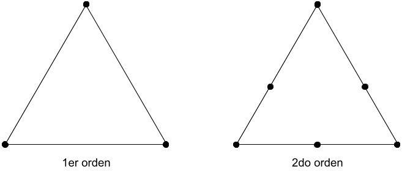
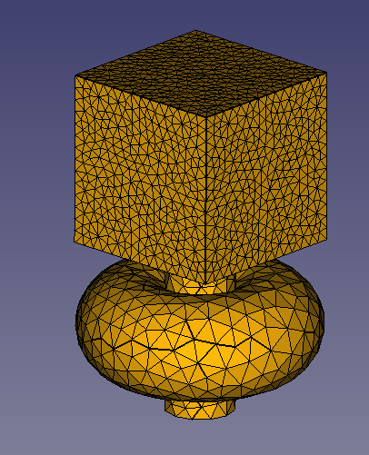

# Mallado

Agni B3V utiliza un mallado FEM como representación numérica del modelo satelital a lo largo de la simulación térmica.

En un mallado FEM, la estructura de un cuerpo se construye a partir de elementos. En dos dimensiones pueden utilizarse triángulos o cuadriláteros, mientras que para tres dimensiones tetraedros y hexaedros son una elección habitual.

A esto se le suma la posibilidad de utilizar elementos de distinto orden. Un mayor orden en los elementos permite una mayor deformación del mallado a lo largo del tiempo de la simulación. Este punto no es de particular interés en la simulación térmica satelital cuando se trabaja entre rangos de temperatura donde la estructura no se deforma significativamente. Además, un mayor orden en el mallado implica un mayor costo computacional.

Es importante que un mallado FEM sea bueno para no introducir mayor error numérico. Para ello, hay ciertos puntos a tener en cuenta:

*  Las transiciones de densidades de elementos en la malla no deben ser abruptas.

*  Las transiciones de densidad de elementos deben estar localizadas lejos de las regiones de mayor interés.

* Es recomendable no tener grandes diferencias entre los elementos de menor y mayor tamaño. Sobre todo si son regiones cercanas.

<i>Órdenes en un elemento triángular bidimensional</i>

## Modelo FEM en Agni B3V

En Agni se utiliza un mallado bidimensional, triangular y de primer orden. Se genera utilizando el mallador Gmsh que se encuentra integrado en FreeCAD. Se hablará con más detalle sobre el modelo numérico en la sección de [Modelo FEM](../fem/fem.md).

A continuación se puede ver un ejemplo concreto de un mallado realizado en FreeCAD:

La generación del mallado se puede ver con mayor detalle en la sección de [Agni Addon](../../user_manual/freecad_addon/freecad_addon.md).
