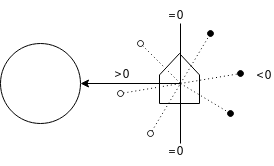
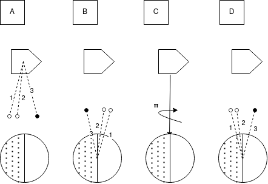

# Interacción Elemento-Tierra

Debido a la poca distancia que los separa, el satélite interactúa con la Tierra como si de un plano infinito se tratase. Los rayos provenientes de la Tierra por radiación infrarroja o albedo (reflejo de la luz solar) son emitidos desde puntos dentro del plano y direcciones aleatorias. El inconveniente con ceñirse a este modelo, tal y como se plantea, es que el área de vista de la Tierra es infinita (y por ende los factores de vista prácticamente nulos) y que al intentar calcular los factores de vista, de todos modos la probabilidad de que un rayo impacte al satélite sería muy baja. Por ello se invierten nuevamente emisor y receptor: se disparan rayos desde los elementos del satélite y se consideran aquellos que no colisionan con otro elemento y cuyo ángulo con la dirección satélite-Tierra es menor a 90 grados o alternativamente, cuyo producto interno es mayor a cero.

El cociente entre rayos que alcanzaron la Tierra y rayos totales es fue una buena primera aproximación del factor de vista elemento-Tierra para radiación, pero no considera la curvatura de la Tierra, ni el ángulo de incidencia del rayo en el elemento. Para incorporar ambos factores se acabó realizando el promedio ponderado de los rayos, tomando como peso la multiplicación del producto interno entre vector satélite-Tierra y rayo (que brinda información del punto de procedencia del rayo) y el producto interno entre la normal del elemento y el rayo (análogo a la corrección por área aparente solar):

\\[ f^{\text{IR}}_{j} = \frac{1}{R _T} \sum^{R _I} _{i = 0} (r _i . v _{se})(r _i .n _j) \\]

Donde:

* \\(f^{\text{IR}}_{j}\\) es el factor de vista del elemento \\(j\\) a la Tierra para la radiación infrarroja.
* \\(R _T\\) es la cantidad de rayos disparados por el método.
* \\(R _I\\) es la cantidad de rayos disparados que impactaron a la Tierra.
* \\(r _i\\) Es el iésimo rayo impactado.
* \\(v _{se}\\) Es el vector unitario en dirección a la Tierra, tomando la posición del satélite como origen de coordenadas.
* \\(n _j\\) Es la normal del elemento \\(j\\).
 
En órbitas sun pointing el satélite rota respecto a la Tierra, por lo que estos factores de vista sí deberán ser calculados para distintos puntos de la órbita.

Con el procedimiento descrito pudo estimarse la energía intercambiada por radiación infrarroja, pero para el albedo debió aplicarse una corrección adicional por cada rayo que impactó al satélite, dependiendo de si había sido emitido desde un punto de la Tierra que el Sol iluminaba o no.

En principio, la Tierra puede considerarse como una esfera partida en dos, una semiesfera iluminada y otra en umbra. Los puntos de la semiesfera iluminada tienen un producto interno por el vector de la dirección solar positivo y los de la semiesfera en umbra un producto interno negativo.

Como los rayos son emitidos desde el satélite hacia la Tierra en el cómputo, el producto interno debe invertirse. Además, es preciso rotar en 180 grados sobre el vector Tierra a satélite, ya que como puede observarse en el segundo caso, los rayos que provienen de zonas iluminadas o en umbra se intercambian si solo se invierte el sentido de los rayos.

Es importante notar que la abrupta transición entre zonas iluminadas y en umbra es consecuencia del mapeo elegido entre producto interno e intensidad de luz (aquí la función de Heavyside). Puede suavizarse la transición entre zona iluminada y umbra e introducir así el efecto de scattering atmosférico, pero no se observó que impactase en los resultados significativamente.

\\[ vf^{Albedo}_{j} = \frac{1}{R _T} \sum^{R _I} _{i = 0} (r _i.v _{es}) \\]

Donde:
* \\(vf^{Albedo}_{j}\\) es el factor de vista del elemento \\(j\\) a la Tierra para la radiación por albedo.
* \\(R _T\\) es la cantidad de rayos disparados por el método.
* \\(R _I\\) es la cantidad de rayos disparados que impactaron a la Tierra.
* \\(r _i\\) Es el iésimo rayo impactado.
* \\(v _{es}\\) Es el vector unitario en dirección al Sol, tomando la posición de la Tierra como origen de coordenadas.
