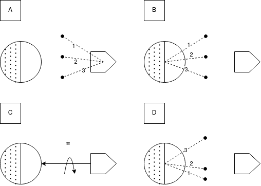

# Interacción Elemento-Tierra

Debido a la poca distancia que los separa, el satélite interactúa con la Tierra como si de un plano infinito se tratase. Los rayos provenientes de la Tierra por radiación infrarroja o albedo (reflejo de la luz solar) serán emitidos desde puntos dentro del plano y direcciones aleatorias. El inconveniente con este modelo es que el área de vista de la Tierra es infinita (y por ende los factores de vista prácticamente nulos) y que al intentar calcular los factores de vista, de todos modos la probabilidad de que un rayo impacte al satélite será muy baja. Por ello se invierten nuevamente emisor y receptor: se disparan rayos desde los elementos del satélite y se consideran aquellos que no colisionan con otro elemento y cuyo ángulo con la dirección satélite-Tierra es menor a 90 grados o alternativamente, cuyo producto interno es mayor a cero.

El cociente entre rayos que alcanzaron la Tierra y rayos totales es una buena primer aproximación del factor de vista elemento-Tierra para radiación, pero no considera la curvatura de la Tierra, ni el ángulo de incidencia del rayo en el elemento. Para incoporar ambos factores puede realizarse el promedio ponderado de los rayos, tomando como peso la multiplicación del producto interno entre vector satélite-Tierra y rayo (que brinda información del punto de procedencia del rayo) y el producto interno entre la normal del elemento y el rayo (ligado al ángulo de incidencia):

\\( vf^{TierraIR}_{elemento j} = \frac{1}{rtotales} \sum^{rimpactados} _{i = 0} (r _i . v _{sat-Tierra})(r _i .normal _j)\\)

El satélite rotará y orbitará respecto a la Tierra, por lo que estos factores deberán ser calculados para distintos puntos de la órbita. Así podrán estimarse la energía intercambiada por radiación infraroja, pero para el albedo deberá aplicarse una corrección por cada rayo que impactó al satélite, dependiendo de si fué emitido desde un punto de la Tierra que el Sol ilumina o no.

En principio la Tierra puede considerarse como una esfera partida en dos, una semiesfera iluminada y otra en umbra. Los puntos de la semiesfera iluminada tienen un producto interno por el vector de la dirección solar positivo y los de la semiesfera en umbra un producto interno negativo. 

Como los rayos son emitidos desde el satélite hacia la Tierra en el cómputo, el producto interno debe invertirse. Además es preciso rotar en 180 grados sobre el vector Tierra a satélite, ya que como puede observarse en el segundo caso, los rayos que provienen de zonas iluminadas o en umbra se intercambian si solo se invierte el sentido de los rayos.

Es importante percatar que la abrupta transición entre zonas iluminadas y en umbra es consecuencia del mapeo elegido entre producto interno e intensidad de luz (aquí la función de Heavyside). Puede suavizarse la transición entre zona iluminada y umbra e introducir así el efecto de scattering atmosférico, pero no se observó que impactase en los resultados significativamente.

\\(  vf^{TierraAlbedo}_{elemento j} = \frac{1}{rtotales} \sum^{rimpactados} _{i = 0} (r _i.v _{Sol-Tierra}) \\)
