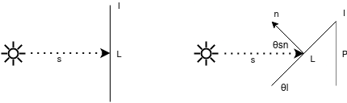

# Interacción Elemento-Sol

Dada la distancia promedio entre el satélite y el Sol, los rayos que éste emite e impactan al satélite lo hacen en un ángulo comparable, es decir, el satélite interactúa con el Sol como si se tratase de un conjunto de rayos paralelos. Además, en una órbita de tipo "Sun pointing"  la aptitud del satélite no se modificará de forma apreciable. Aun así, fue necesario rotar el modelo del satélite para alinearlo con el Sol al inicio de la simulación. Para ello, se definió que se modele el mismo tomando al eje Z en sintido positivo como la dirección hacia el Sol.

Fue posible simplificar aún más la estimación de las zonas iluminadas. En vez de emitir rayos desde el plano definido por la dirección del Sol, esperando que se alcancen todos los elementos del satélite, pueden emitirse rayos desde los elementos hacia el Sol. Si un rayo colisiona con el propio satélite, el rayo inverso Sol-satélite también colisionará (aunque no necesariamente con el mismo punto), mientras que de perderse el rayo en el espacio, necesariamente el rayo inverso podría llegar al elemento sin problemas.

Por último, se debió aplicar una corrección de intensidad de las áreas iluminadas por el área aparente, lo que está implícito en el método Monte Carlo al promediar la colisión de múltiples rayos. En la figura observamos el caso bidimensional en donde la longitud del elemento es L, pero debido al ángulo de su normal respecto a la dirección de incidencia de los rayos solares, la proporción de radiación que recibe es menor:

\\[
P = L \sin({\theta} _l)
\\]

\\[
\theta_n = \theta _l + \frac{\pi}{2}
\\]

\\[
\theta_{sn} = \pi - \theta_n = \frac{\pi}{2} - \theta _l
\\]

Entonces:

\\[
P = L \sin(\frac{\pi}{2} - \theta_{sn}) = L \cos(\theta_{sn})
\\]

Al utilizar elementos con vértices coplanares para el mallado (en nuestro caso triángulos), este razonamiento puede extenderse directamente al caso tridimensional.