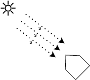

# Interacción Elemento-Sol

En primer lugar, debe asegurarse que la rotación del satélite sea la esperada en cada punto de la trayectoria.  Sin embargo, en órbitas sun pointing y por la enorme distancia a la que se encuentra el Sol respecto al satélite, la rotación en relación al Sol no varía significativamente en el tiempo. Aún así, puede ser necesario alinear al satélite con el Sol al comienzo del preprocesado. Para ello se ha definido que se modele el mismo tomando al eje Z en sentido positivo como la dirección hacia el Sol. 

Otra consecuencia de la lejanía del Sol es que los rayos que este emite e impáctan al satélite lo hacen en un ángulo comparable, es decir, el satélite interactúa con el Sol como si se tratase de un conjunto de rayos paralelos.

Es posible simplifcar aún más la estimación de las zonas iluminadas. Partiendo de la premisa de que algún rayo eventualmente alcanzará un elemento si éste no es obstruído por otro, pueden emitirse rayos desde tal elemento en dirección al Sol. Si esos rayos no impactan otro elemento significa que efectivamente ese elemento será iluminado (ve al Sol, por lo que el Sol puede verlo a él), de lo contrario al menos el mismo elemento que lo obstaculiza evitaría que un rayo emitido desde el Sol lo alcanzase.

Por último, deberá corregirse la intensidad de las áreas iluminadas por el área aparente. En la figura observamos el caso bidimensional en donde la longitud del elemento es L, pero debido al ángulo de su normal respecto a la dirección de incidencia de los rayos solares la proporción de radiación que recibe será P = L sen(θl) en su lugar.  Como θn = θl + π/2, entonces θsn = π - θn = π/2 - θl y P = L sen(π/2 - θsn) = L cos(θsn). Si se utilizan elementos con vértices coplanares para el mallado, este razonamiento puede extenderse directamente al caso tridimensional.