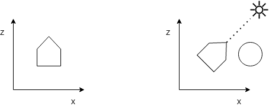
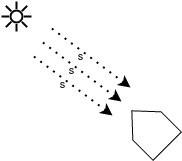
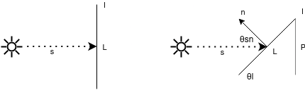
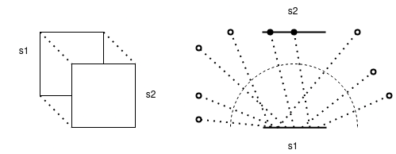
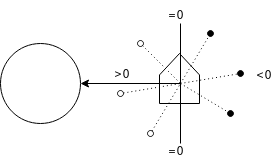
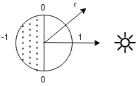
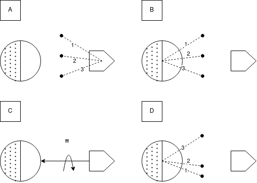
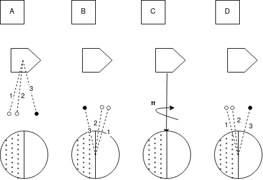

# Preprocesador

El modelo tridimensional del satélite, junto con los materiales asignados a cada polígono que lo compone, son información suficiente para el cálculo de la transmisión de calor por conducción y estos datos se encuentran estructurados de forma tal que es preciso y eficiente considerar solo el aporte de la vecindad para cualquier punto en un tiempo determinado.

Para la transmisión de calor por radiación deberán contemplarse además la posición de la Tierra y el Sol, así como el modo en que las distintas partes del satélite eclipsan a otras. La energía recibida en un punto es el resultado de integrar los rayos que fueron emitidos/reflejados por otros cuerpos u elementos del mismo cuerpo.

Con el fin de recuperar la localidad de las operaciones en la radiación y así poder computarla junto con la conducción en una misma operación, se ha introducido aquí una transformación de los datos: Se desprecia la trayectoria de los rayos (que no interactúan con el medio por viajar en el vacío) y se simplifica el modelo a un aporte energético cuerpo a cuerpo o elemento a elemento. Como ventaja adicional la magnitud del aporte energético se separa de la proporción que se esperaría que un cuerpo reciba de otro, permitiendo reutilizar parámetros geométricos en distintos escenarios físicos.

## Interacción Elemento-Sol

En primer lugar, debe asegurarse que la rotación del satélite sea la esperada en cada punto de la trayectoria.  Sin embargo, en órbitas sun pointing y por la enorme distancia a la que se encuentra el Sol respecto al satélite, la rotación en relación al Sol no varía significativamente en el tiempo. Aún así, puede ser necesario alinear al satélite con el Sol al comienzo del preprocesado. Para ello se ha definido que se modele el mismo tomando al eje Z en sentido positivo como la dirección hacia el Sol. 

Otra consecuencia de la lejanía del Sol es que los rayos que este emite e impáctan al satélite lo hacen en un ángulo comparable, es decir, el satélite interactúa con el Sol como si se tratase de un conjunto de rayos paralelos.

Es posible simplifcar aún más la estimación de las zonas iluminadas. Partiendo de la premisa de que algún rayo eventualmente alcanzará un elemento si éste no es obstruído por otro, pueden emitirse rayos desde tal elemento en dirección al Sol. Si esos rayos no impactan otro elemento significa que efectivamente ese elemento será iluminado (ve al Sol, por lo que el Sol puede verlo a él), de lo contrario al menos el mismo elemento que lo obstaculiza evitaría que un rayo emitido desde el Sol lo alcanzase.

Por último, deberá corregirse la intensidad de las áreas iluminadas por el área aparente. En la figura observamos el caso bidimensional en donde la longitud del elemento es L, pero debido al ángulo de su normal respecto a la dirección de incidencia de los rayos solares la proporción de radiación que recibe será P = L sen(θl) en su lugar.  Como θn = θl + π/2, entonces θsn = π - θn = π/2 - θl y P = L sen(π/2 - θsn) = L cos(θsn). Si se utilizan elementos con vértices coplanares para el mallado, este razonamiento puede extenderse directamente al caso tridimensional.

## Interacción Elemento-Elemento

En línea con la descomposición en interacciones elemento-elemento descrita al comienzo de esta sección, debe calcularse para cada par de elementos la energía que intercambian. Como se emiten rayos en igual medida en todas direcciones, esto proporcional al factor de vista.

El factor de vista es la fracción del campo de visión que ocupa una superficie respecto a otra y el método más popular para su cómputo es Monte Carlo, en donde se seleccionan puntos del elemento emisor y direcciones al azar en la que se emiten rayos, se toma registro de los elementos impactados y luego se estima el factor de vista como la razón entre los rayos impactados y el total de rayos emitidos.

Introducir reflexiones es simple, para cada rayo que colisionó se genera un número pseudoaleatorio y se lo compara con el alphaSun del material del elemento impactado, si es menor se considera el rayo para el view factor del elemento impactado, de lo contrario se reemite el rayo desde la posición de la colisión en la dirección reflejada respecto a la normal del elemento. Se introdujo un límite de reflexiones consideradas para asegurar que el algoritmo finalice en tiempo finito, aunque gracias a esto es posible que una fracción de rayos se pierdan cuando en la realidad no sería así.

Notar que los factores de vista elemento a elemento solo dependen de la geometría del modelo del satélite, y por tanto solo deberán calcularse una única vez.

## Interacción Elemento-Tierra

Debido a la poca distancia que los separa, el satélite interactúa con la Tierra como si de un plano infinito se tratase. Los rayos provenientes de la Tierra por radiación infrarroja o albedo (reflejo de la luz solar) serán emitidos desde puntos dentro del plano y direcciones aleatorias. El inconveniente con este modelo es que el área de vista de la Tierra es infinita (y por ende los factores de vista prácticamente nulos) y que al intentar calcular los factores de vista, de todos modos la probabilidad de que un rayo impacte al satélite será muy baja. Por ello se invierten nuevamente emisor y receptor: se disparan rayos desde los elementos del satélite y se consideran aquellos que no colisionan con otro elemento y cuyo ángulo con la dirección satélite-Tierra es menor a 90 grados o alternativamente, cuyo producto interno es mayor a cero.

El cociente entre rayos que alcanzaron la Tierra y rayos totales es una buena primer aproximación del factor de vista elemento-Tierra para radiación, pero no considera la curvatura de la Tierra, ni el ángulo de incidencia del rayo en el elemento. Para incoporar ambos factores puede realizarse el promedio ponderado de los rayos, tomando como peso la multiplicación del producto interno entre vector satélite-Tierra y rayo (que brinda información del punto de procedencia del rayo) y el producto interno entre la normal del elemento y el rayo (ligado al ángulo de incidencia):

\\( vf^{TierraIR}_{elemento j} = \frac{1}{rtotales} \sum^{rimpactados} _{i = 0} (r _i . v _{sat-Tierra})(r _i .normal _j)\\)

El satélite rotará y orbitará respecto a la Tierra, por lo que estos factores deberán ser calculados para distintos puntos de la órbita. Así podrán estimarse la energía intercambiada por radiación infraroja, pero para el albedo deberá aplicarse una corrección por cada rayo que impactó al satélite, dependiendo de si fué emitido desde un punto de la Tierra que el Sol ilumina o no.

En principio la Tierra puede considerarse como una esfera partida en dos, una semiesfera iluminada y otra en umbra. Los puntos de la semiesfera iluminada tienen un producto interno por el vector de la dirección solar positivo y los de la semiesfera en umbra un producto interno negativo. 

Como los rayos son emitidos desde el satélite hacia la Tierra en el cómputo, el producto interno debe invertirse. Además es preciso rotar en 180 grados sobre el vector Tierra a satélite, ya que como puede observarse en el segundo caso, los rayos que provienen de zonas iluminadas o en umbra se intercambian si solo se invierte el sentido de los rayos.

Es importante percatar que la abrupta transición entre zonas iluminadas y en umbra es consecuencia del mapeo elegido entre producto interno e intensidad de luz (aquí la función de Heavyside). Puede suavizarse la transición entre zona iluminada y umbra e introducir así el efecto de scattering atmosférico, pero no se observó que impactase en los resultados significativamente.

\\(  vf^{TierraAlbedo}_{elemento j} = \frac{1}{rtotales} \sum^{rimpactados} _{i = 0} (r _i.v _{Sol-Tierra}) \\)
