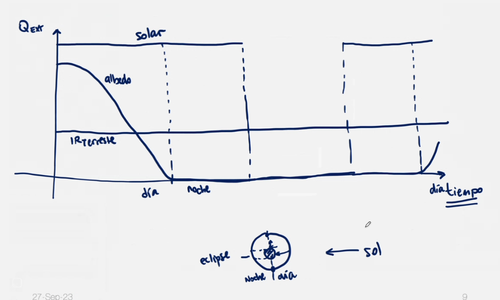

# Modelo teórico

## Transferencia de Calor

En lineas generales, la transferencia de calor puede explicarse a través de 3 fenómenos distintos: la conducción, la convección y la radiación.

Dado que la densidad del aire a altitudes muy elevadas es extremadamente baja, a partir de órbitas terrestres bajas (LEO) en adelante la transferencia de calor es, practicamente en su totalidad, debida a la conducción y radiación.
Es por esto que, es posible omitir el fenómeno de convección en el modelo.

Sin convección natural para enfriar la electrónica, un sistema que funciona con la misma potencia en el espacio es más probable que alcance una temperatura más alta en comparación con uno que opera a nivel del mar.

### Transferencia de Calor por Conducción

La transferencia de calor puede ocurrir dentro de un material o entre dos o más cuerpos en contacto. Está dada por la Ley de Fourier, en una dimensión:
  

\\[
f^{''}_x = -k \frac{dT}{dx}
\\]

Donde:

- \\(q\\) es la tasa de flujo de calor (\\(\frac{W}{m^2}\\))
- \\(k\\) es la conductividad térmica (\\(\frac{W}{m \*K}\\)) del material
- \\(\frac{dT}{dx}\\) es la diferencia de temperatura a lo largo de la longitud

 
En el caso más general, la ecuación se expresa en forma diferencial
  

\\[
c p \frac {\partial T}{\partial t} =
k \ (\frac {\partial^2 T}{\partial x^2} +
\frac {\partial^2 T }{\partial y^2} +
\frac {\partial^2 T }{\partial z^2}) + q_v
\\]

Donde:

- \\(c\\) es el calor específico \\([\frac{J}{Kg \ K}]\\)
- \\(p\\) la densidad \\([\frac{Kg}{m^3}]\\)
- \\(q_v\\) el calor generado \\([\frac{W}{m^3}]\\)

### Transferencia de Calor por Radiación

La transferencia de calor por radiación ocurre entre dos o más superficies a través de ondas electromagnéticas. Depende de la temperatura y del revestimiento de la superficie radiante.
El tipo de emisor más eficiente es conocido como cuerpo negro. La radiación que emite por unidad de área a una temperatura dada sigue la Ley de Stefan-Boltzmann.
  

\\[
E = \sigma \ T^4
\\]

Donde:

- \\(σ\\) es la constante de Stefan-Boltzmann (\\(5.63 \times 10^{-8} \frac{W}{m^2 K^4}\\))
- \\(T\\) es la temperatura del cuerpo negro \\([K]\\)

Multiplicando por el area radiante \\(A^r\\), se obtendrá el calor absoluto emitido por el cuerpo negro \\(E_r [W]\\):

\\[
E_r = A^r \sigma \ T^4
\\]
 

A un cuerpo que no irradia con la misma eficiencia que un cuerpo negro se lo conoce como cuerpo gris. La radiación emitida por un cuerpo gris hace uso de la ecuación de cuerpo negro, corregida por un factor de emisividad.
  

\\[ E_{gris} = ε A^r \sigma \ T^4 \\]

Donde:

- \\(ε\\) es la emisividad del cuerpo gris

 
El calor transferido desde un cuerpo gris (1), hacia otro cuerpo gris (2) por radiación puede expresarse de la siguiente forma:
  

\\[f_{1,2} = \sigma \ ε_1 \ \alpha_2 \ F_{1,2} \ A_1 \ T_1^4\\]

Donde:

- \\(ε_1\\) es la emisividad de la superficie del cuerpo 1.
- \\(\alpha_2\\) es la absortividad de la superficie del cuerpo 2.
- \\(F\_{1,2}\\) es el factor de vista entre la superficie del cuerpo 1 y el cuerpo 2
- \\(A_1\\) es el área de la superficie del cuerpo 1.
- \\(T_1\\) es la temperatura del cuerpo 1.

El factor de vista de una superficie 1 hacia una superficie 2 se define como la porción del campo de visión de la superficie 1 que es ocupada por la superficie 2. Dado que se trata de un porcentaje, este toma valores entre cero y uno.

Así como el factor de emisividad corrige la diferencia de emisión de un cuerpo gris frente a la emisión teórica de un cuerpo negro, el factor de absortividad realiza la misma corrección sobre la cantidad de energía absorbida por la superficie de un cuerpo gris.
Dado que ambos factores suelen ser similares (para una misma superficie), se suelen simplificar las ecuaciones reemplazando la emisividad por la absortividad.
Es importante aclarar que tanto la absortividad como la emisividad dependen no solo de la superficie en cuestión, sino también de la frecuencia de la radiación emitida o recibida.

## Fuentes de Calor en Sistemas Espaciales

En un sistema espacial existen, generalmente, tres fuentes de calor:

- Radiación del sol.
- Radiación de albedo.
- Radiación infrarroja terrestre.
    

### Radiación solar

Es la principal fuente de calor y puede ser considerada constante. Suele rondar entre 1322 \\(\frac{W}{m^2}\\) y 1414 \\(\frac{W}{m^2}\\).

La radiación proveniente desde el sol e incidente sobre una superficie se encuentra en función del flujo solar \\(S \ [\frac{W}{m^2}]\\) y de la orientación de esta con respecto al sol.
Debido a la gran distancia con el sol, se puede tomar la suposición de que la radiación esta dada por rayos paralelos.

El calor recibido por una superficie \\(i\\) debido a la radiación proveniente del sol estará dado por:
  

\\[
f_{Solar} = \alpha_i^{Sun} F_{Sun,i} \ A_i S
\\]

\\(\alpha_i^{Sun}\\) considera la absortividad de la superficie \\(i\\) bajo la frecuencia de las ondas electromagnéticas emitidas por el sol.

### Albedo

El albedo refiere a la radiación solar reflejada desde la superficie terrestre. Se suele expresar como la fracción de radiación solar incidente que es reflejada hacia el espacio.
  

\\[ f = A_f S\\]

Donde:

- \\(A_f\\) es el factor de albedo
- S es la constante solar \\([\frac{W}{m^2}]\\)

El albedo promedio de la tierra es de aproximadamente 0.3.

De esta forma, es posible expresar el calor recibido por una superficie \\(i\\) debido al albedo de la siguiente forma:
  

\\[
f_{Albedo} = \alpha_i^{Sun} F_{Earth,i} \ A_i A_{f_i} S
\\]

### Radiación Infraroja Terrestre

La radiación Infraroja (IR) terrestre refiere a la radiación emitida por la tierra por el simple hecho de tratarse de un cuerpo con temperatura mayor a cero grados absolutos. Por lo general se considera que esta radiación es constante a lo largo de su superficie y se la suele tomar con un valor cercano a 235 \\(\frac{W}{m^2}\\).

El calor recibido por una superficie S debido a radiación IR estará dado por:
  

\\[
f_{IR} = \alpha_i^{IR} F_{Earth,i} \ E_{IR}
\\]

Donde:

- \\(E\_{IR}\\) es la constante de IR terrestre \\([\frac{W}{m^2}]\\)

## Transferencia de calor en el satelite

Además de recibir energía por radiación del sol y la tierra, un satélite emite hacia su alrededor.

Tratandose de un cuerpo gris, el flujo de calor emitido por una superficie del satélite estará dado por:
  

\\[
f_{Lost} = \alpha^{IR} A^r \sigma \ T^4
\\]
 

Parte de esta energía será perdida en el espacio y otra parte será absorbida por otras superficies del propio satélite.
El flujo recibido por una superficie \\(j\\) del satélite, debido a la emisión de una superficie \\(i\\) estará dado por:
  

\\[
f_{i,j}^{elem} = \sigma \ \alpha_i^{IR} \alpha_j^{IR} F_{i,j} A_i \ T_i^4
\\]
