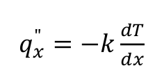
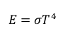
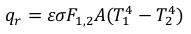
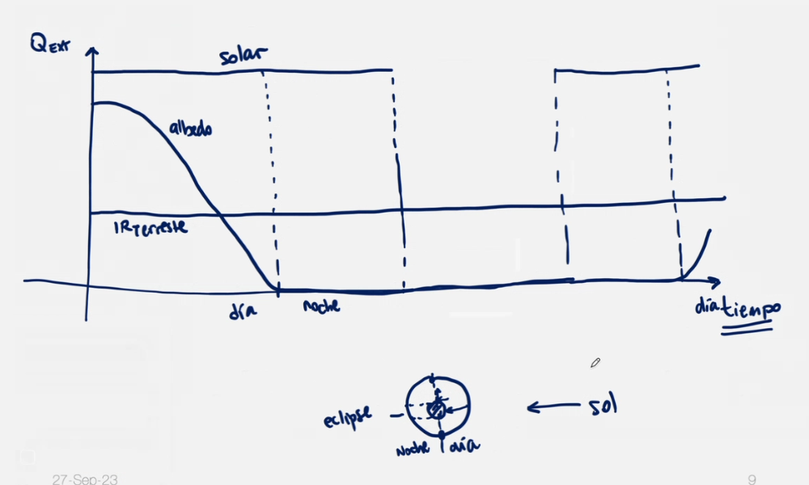
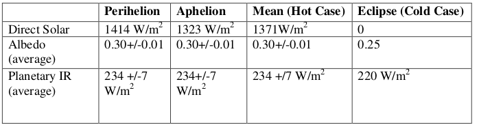

Modelo teórico
==============

Transferencia de Calor
----------------------

El calor se transfiere de 3 maneras:

*   Convección
*   Conducción
*   Radiación

Dado que la densidad del aire a altitudes muy elevadas es extremadamente baja, desde la órbita terrestre baja (LEO) en adelante, el aire disponible para la refrigeración natural es insignificante, por lo que no hay convección. La transferencia de calor en el espacio está principalmente controlada por la conducción y la radiación.

Sin convección natural para enfriar la electrónica, un sistema que funciona con la misma potencia en el espacio es más probable que alcance una temperatura más alta en comparación con uno que opera a nivel del mar.

### Transferencia de Calor por Conducción

La transferencia de calor puede ocurrir dentro de un material o entre dos o más cuerpos en contacto. Está dada por la Ley de Fourier, en una dimensión:

*   q es la tasa de flujo de calor ($\frac{W}{m^2}$)
*   k es la conductividad térmica ($\frac{W}{m *K}$) del material
*   dT/dx es la diferencia de temperatura a lo largo de la longitud

A diferencia del modo de transferencia de calor por convección, la resistencia a la conducción dentro del sólido no cambia con la altitud.

En el caso más general, la ecuación se expresa en forma diferencial

$c p \frac {\partial T}{\partial t} = k * (\frac {\partial^2 T}{\partial x^2} + \frac {\partial^2 T }{\partial y^2}  + \frac {\partial^2 T }{\partial z^2}) + q_v$

Siendo c el calor específico, p la densidad y $q_v$ el calor generado

### Transferencia de Calor por Radiación

La transferencia de calor por radiación ocurre entre dos o más superficies a través de ondas electromagnéticas. Depende de la temperatura y del revestimiento de la superficie radiante. Sigue la Ley de Stefan-Boltzmann:

*   σ es la constante de Stefan-Boltzmann -> 5.67x10\-8 W/m2K4

La cantidad de energía transferida por radiación entre dos objetos con temperaturas T1 y T2 se encuentra con:

*   qr es la cantidad de transferencia de calor por radiación (W)
*   ε es la emisividad de la superficie radiante (reflectante = 0, absorbente = 1)
*   F1,2 es el factor de vista entre el área de la superficie del cuerpo 1 y el cuerpo 2 (≤1)

A menos que la diferencia entre dos o más cuerpos sea alta, la transferencia de calor por radiación suele ser muy baja.

*   La radiación entre el sol y el satélite debe ser tenida en cuenta..
*   La radiación entre los componentes electrónicos internos puede ser desestimada.

Fuentes de Calor en Sistemas Espaciales
---------------------------------------

Hay generalmente tres fuentes de calor:

*   Radiación del sol
*   El albedo
*   Calentamiento planetario proveniente de la Tierra (radiación de cuerpo negro de la Tierra)

* * *

### Radiación solar

La actividad solar varía diariamente. La variación entre “solar maxima and minima” a veces determina el diseño de la nave. Sin embargo, a veces se utiliza el flujo solar medio durante un período prolongado de tiempo.

### Albedo

El albedo es la radiación solar reflejada desde la superficie terrestre. El albedo promedio de la tierra es de aproximadamente 0.3.

### Radiación IR

La radiación IR refiere a la radiación emitida por la tierra por el simple hecho de tratarse de un cuerpo con temperatura mayor a cero grados absolutos. Por lo general se considera que esta radiación es constante a lo largo de su superficie y se la suele tomar con un valor cercano a 235 W/m2.

#### Ejemplo de desarrollo de simulaciones

Con el objetivo de simplificar las simulaciones, al momento de comenzar un análisis sobre un satélite se suelen configurar los parámetros dividiendo al escenario en cuatro casos de estudio, entre ellos:

*   Perihelio: Punto de mayor cercanía de la tierra con el sol.
*   Afelio: Punto de mayor lejanía de la tierra con el sol.

*   Caso caliente: Se consideran los parámetros tal que el satélite alcance la mayor temperatura de la órbita.
*   Caso frio: Se consideran los parámetros tal que el satélite alcance la menor temperatura de la órbita.

A continuación se observa un cuadro con los casos comentados y los parámetros de las fuentes de calor asociados a cada uno de ellos:

* * *