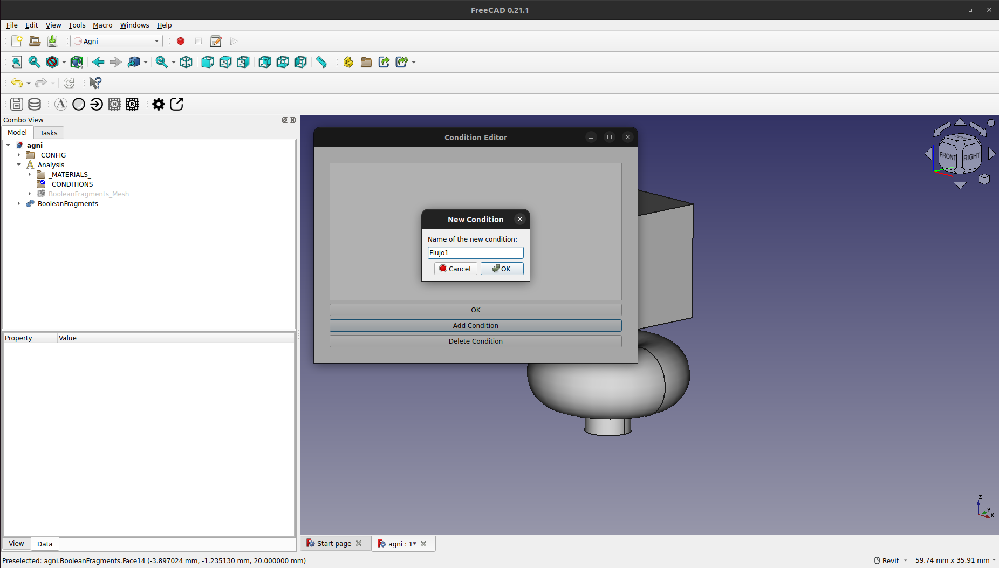
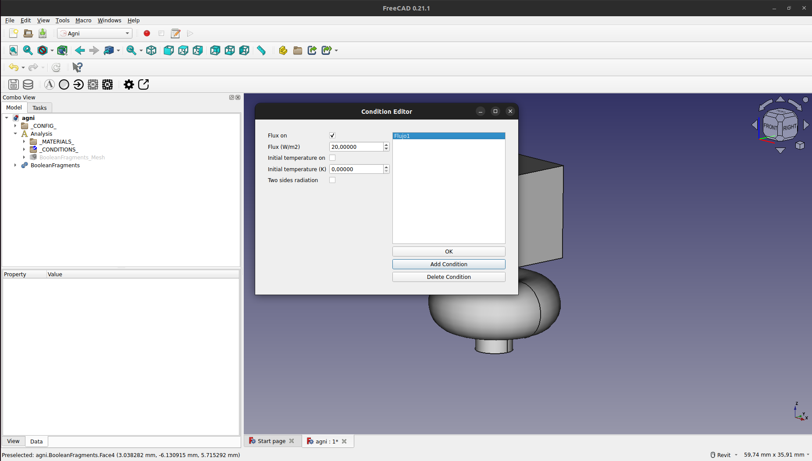
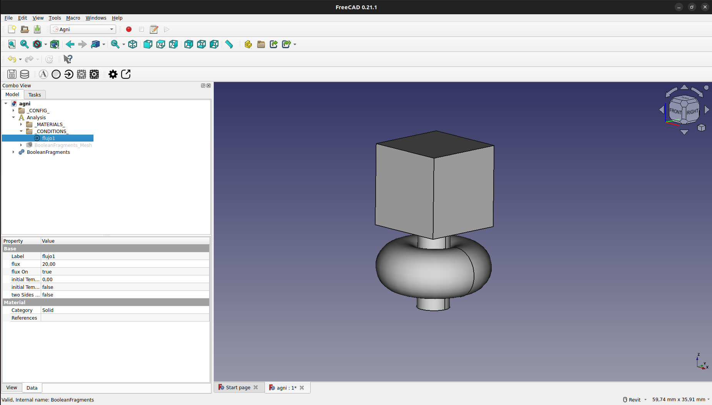
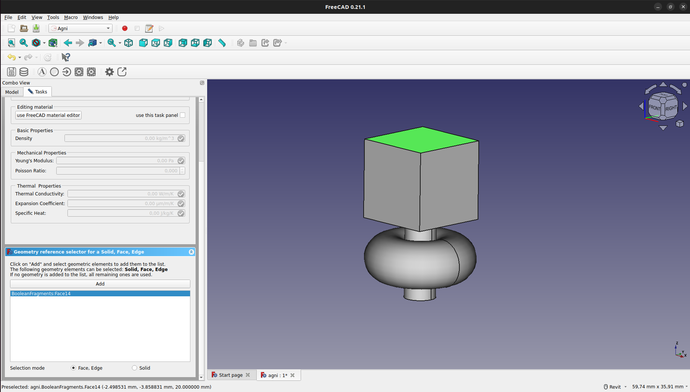
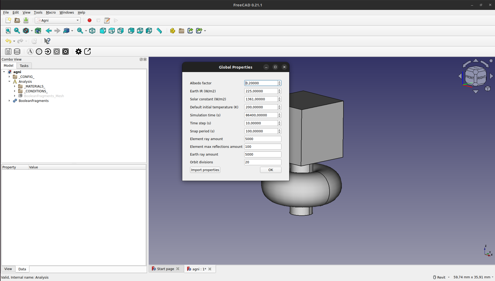
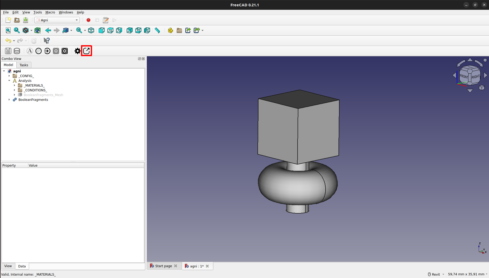
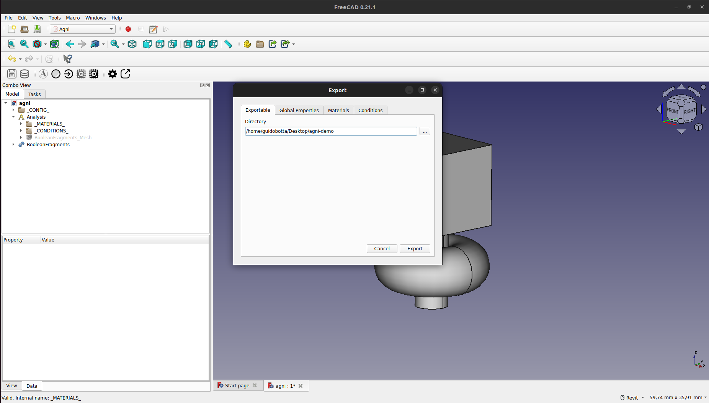

# Agni Addon

Para facilitar el uso de las herramientas que permiten realizar y visualizar una simulación térmica satelital, se ofrece un addon para FreeCAD. Este agrega un nuevo workbench, cuyo uso se detallará a continuación.

<i></i>

## Prerrequisito

Para la utilización completa del workbench, es necesario haber creado un modelo con anterioridad. Si aún no completó este paso, vaya a la sección de [Modelado](../freecad_model/freecad_model.md).

## Creación de Mallado FEM

Para la creación de un mallado FEM, se debe seleccionar el objeto del modelo y presionar en el botón del mallado, como se ve a continuación:

<i></i>

Esto generará automáticamente una malla de triángulos bidimensionales de primer orden, tal cual requiere el sistema para funcionar correctamente. La malla se creará bajo el grupo "Analysis" con el nombre "\<nombre_objeto\>_Mesh", en este caso "BooleanFragments_Mesh".

<i></i>

Si se hace doble click en el objeto de la malla, se abrirá un cuadro el cual permite editar el tamaño máximo y mínimo de elemento. En caso de cambiar uno de estos parámetros, se debe recrear la malla presionando el botón "Apply".

Es importante no cambiar los valores de "Element dimension" y "Element order" para garantizar el correcto funcionamiento del sistema.

<i></i>

### Regiones

Es posible crear regiones para darle un mayor o menor detalle a las distintas superficies o sólidos del modelo. Para ello, se debe presionar el botón de creación de regiones, como se indica a continuación:

<i></i>

La región se creará bajo el grupo de la malla, con el nombre de "MeshRegion" o "MeshRegionNNN" si hay más de una región. 

<i></i>

Al hacer doble click sobre la región creada se abrirá un cuadro el cual permite editar el máximo tamaño de elemento y sobre qué región queremos aplicar esta restricción.

<i></i>

Una vez aplicada la restricción, se debe apretar "OK", volver a abrir el cuadro de y apretar el botón de "Apply" para regenerar la malla con la nueva restricción.

<i></i>

Como podemos ver a continuación, se regeneró la malla con un detalle mucho mayor sobre la región restringida.

<i></i>

## Asignación de Materiales

Para crear un nuevo material, se debe presionar el botón de edición de materiales, como se muestra a continuación:

<i></i>

Esto abrirá una ventana con el editor de materiales, en el cual se debe presionar "Add Material" para agregar un nuevo material.

<i></i>

Se debe poner un nombre, "Aluminio" en este caso, y presionar "OK".

<i></i>

Esto creara el nuevo material, el cual se puede editar presionando sobre el mismo.

<i></i>

Una vez creado, aparecerá en el panel del modelado con el nombre elegido, bajo el grupo de "\_MATERIALS\_"

<i></i>

Finalmente, para asignar el material, se debe hacer doble click en el objeto del material en el panel "Model". Esto abrirá un cuadro en el que se podrá asignar el material tanto a solidos como a caras.

No se deben asignar materiales a ejes, ya que este no es soportado por el sistema y romperá al momento de la exportación del mallado y propiedades.

<i></i>

## Asignación de Condiciones de Contorno

Para crear una nueva condición de contorno, se debe presionar el botón de edición de condiciones, como se muestra a continuación:

<i></i>

Esto abrirá una ventana con el editor de condiciones, en el cual se debe presionar "Add Condition" para agregar una nueva condición.

<i></i>

Se debe poner un nombre, "Flujo1" en este caso, y presionar "OK".

<i></i>

Esto creará la nueva condición, la cual se puede editar presionando sobre la misma.

<i></i>

Una vez creada, aparecerá en el panel del modelado con el nombre elegido, bajo el grupo de "\_CONDITIONS\_"

<i></i>

Finalmente, para asignar la condición, se debe hacer doble click en el objeto de la condición en el panel "Model". Esto abrirá un cuadro en el que se podrá asignar la condición tanto a sólidos como a caras.

No se deben asignar condiciones a ejes, ya que este no es soportado por el sistema y romperá al momento de la exportación del mallado y propiedades.

<i></i>

## Edición de Propiedades Globales

Para editar las propiedades globales, se debe presionar el botón de edición de propiedades globales, como se muestra a continuación:

<i></i>

Esto abrirá una ventana con el editor de propiedades globales. Aquí se podrán editar propiedades tanto correspondiente al sistema como a la simulación en sí.

<i></i>

## Exportación del Mallado y Propiedades

Para exportar el mallado y las propiedaes, se debe presionar el botón de exportado, como se muestra a continuación:

<i></i>

Esto abrirá una ventana para la exportación. En esta ventana se podrá editar el path de exportación, que por defecto será la ubicación del proyecto. Se recomienda no editar esta ubicación a menos que sea necesario, ya que puede traer problemas en la ejecución de los pasos siguientes.

<i></i>

Para realizar el exportado, se debe presionar en el botón "Export". Esto generará, en el directorio seleccionado, un archivo "mesh.vtk", con la representación del mallado, y un archivo "properties.json", con las propiedades globales, los materiales y las condiciones de contorno.
