# Modelado

A continuación se mostrará un ejemplo sencillo de modelado con el objetivo de contar con un modelo para ejemplificar el uso del addon más adelante.

Al abrir FreeCAD nos encontraremos con la siguiente ventana:

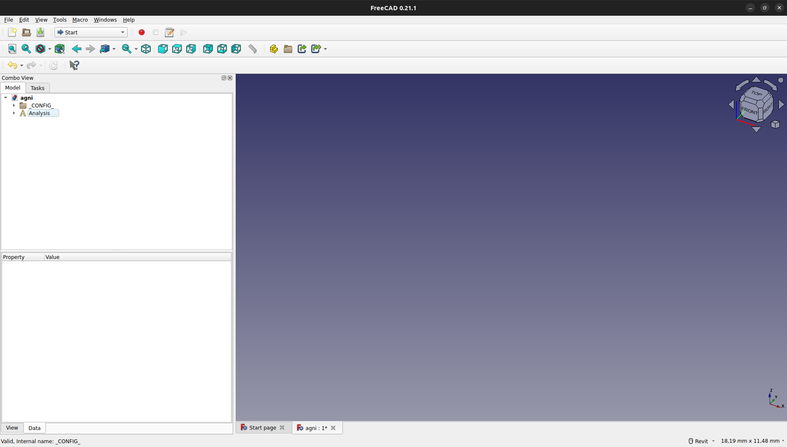

<i></i>

Para comenzar, iremos al workbench *Part*.

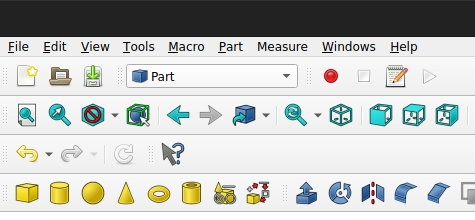

<i></i>

Aquí nos encontraremos elementos para crear como cubos, cilindros, esferas, etc. Crearemos tres elementos, un cubo, un toro y un cilindro.

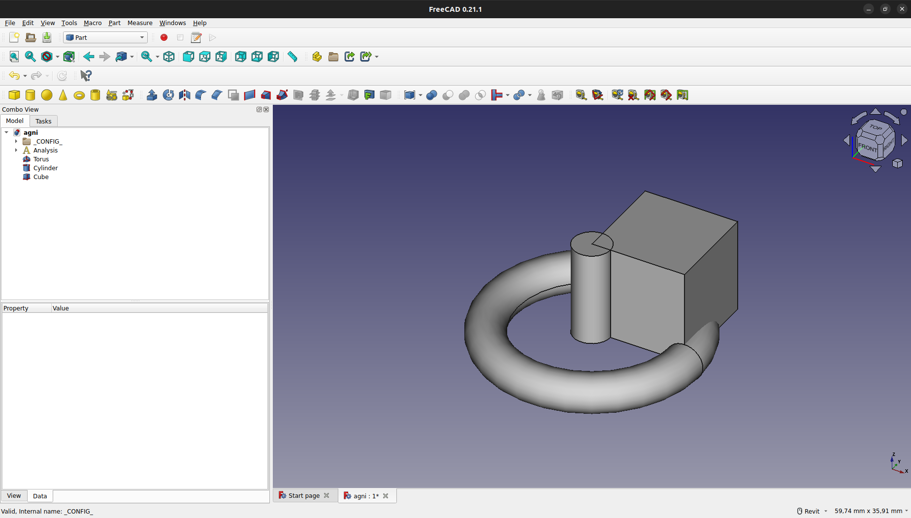

<i></i>

Para mover los elementos, seleccionaremos uno de ellos, haremos click derecho y presionaremos en "Transform".

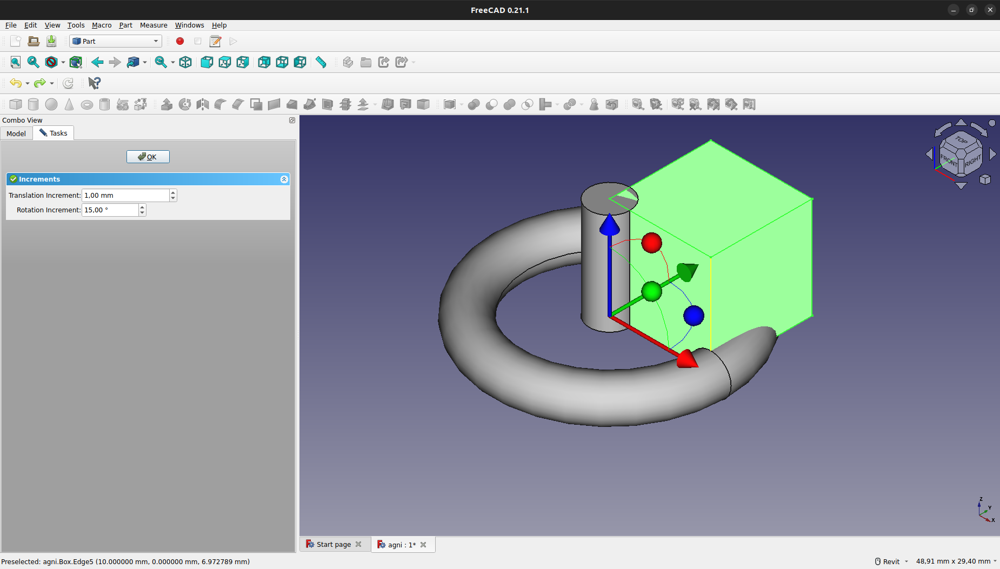

<i></i>

Una vez los movamos, tendremos un resultado como el siguiente:

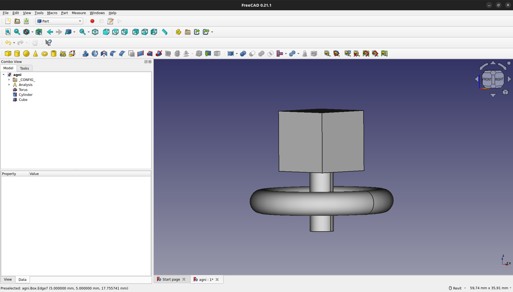

<i></i>

Para cambiar el tamaño de los elementos, seleccionaremos en el elemento que deseemos y, en la pestaña de "Data", podremos variar radio, longitud, entre otros.

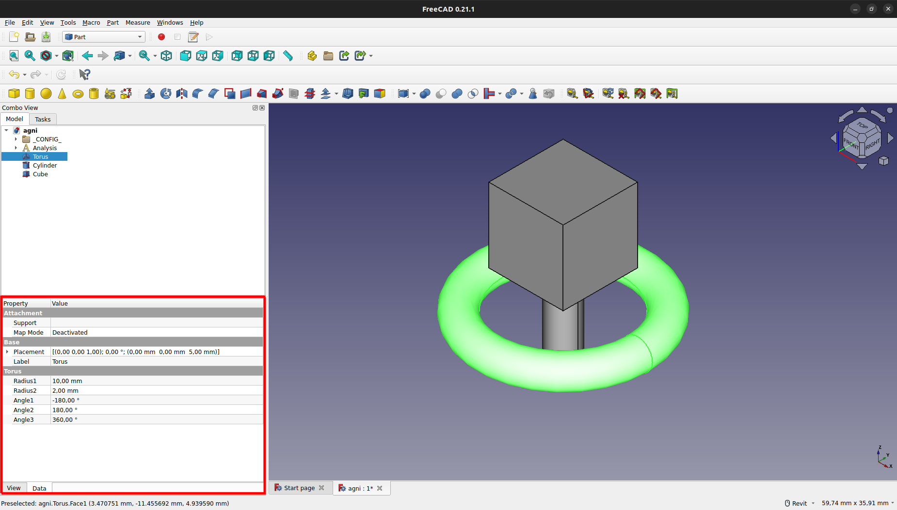

<i></i>

En este caso, variaremos el radio del toro, obteniendo el siguiente resultado:

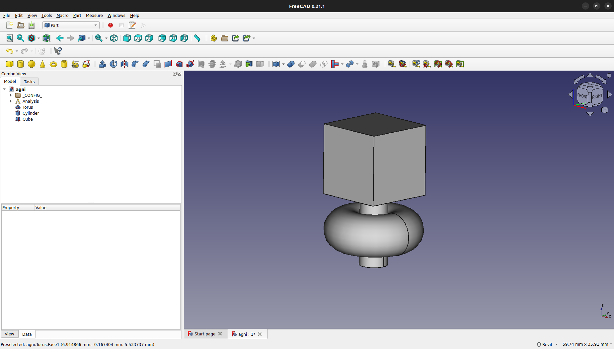

<i></i>

Una vez posicionados y redimensionados los elementos, los seleccionaremos:

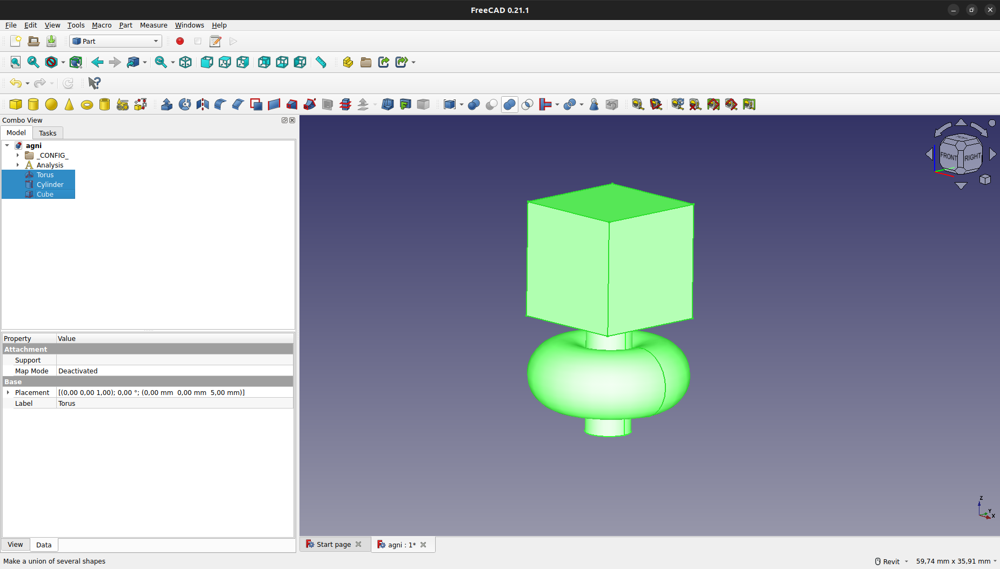

<i></i>

Y a continuación, crearemos un "Fusion" y un "Boolean Fragments".

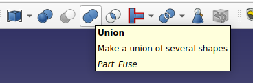

<i></i>

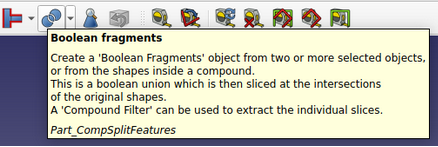

<i></i>

Ahora si, podremos visualizar el resultado final del modelo básico creado:

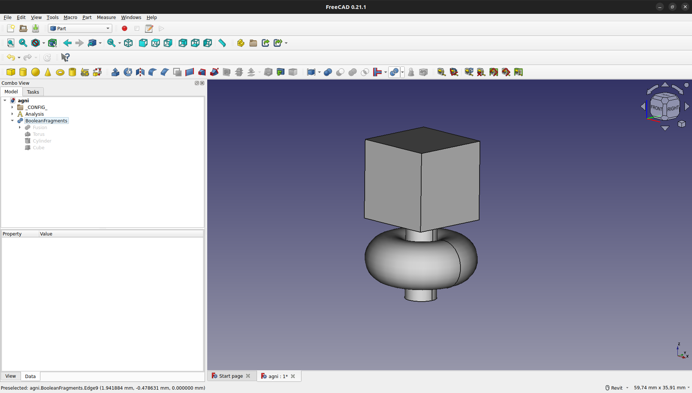

<i></i>

## Macro WorkFeature (recomendada)

Se recomienda el uso de la macro WorkFeature para la verificación de la orientación de las normales en tiempo de modelado. Para su instalación y tutoriales visitar <https://github.com/Rentlau/WorkFeature/tree/master>.

## Tutoriales

Para profundizar en la realización de modelos más complejos, recomendamos buscar entre los diversos tutoriales que hay en la wiki de freecad, los foros de freecad y youtube. Dejamos algunos enlaces para comenzar:

- <https://wiki.freecad.org/Getting_started>
- <https://wiki.freecad.org/Basic_modeling_tutorial>
- <https://forum.freecad.org/viewforum.php?f=36>
- <https://www.youtube.com/watch?v=i2sQOnKn82o&list=PLSoJI9XzEIQyU80RC4QSMhupB1A-OgiCG&ab_channel=FreeCAD>
