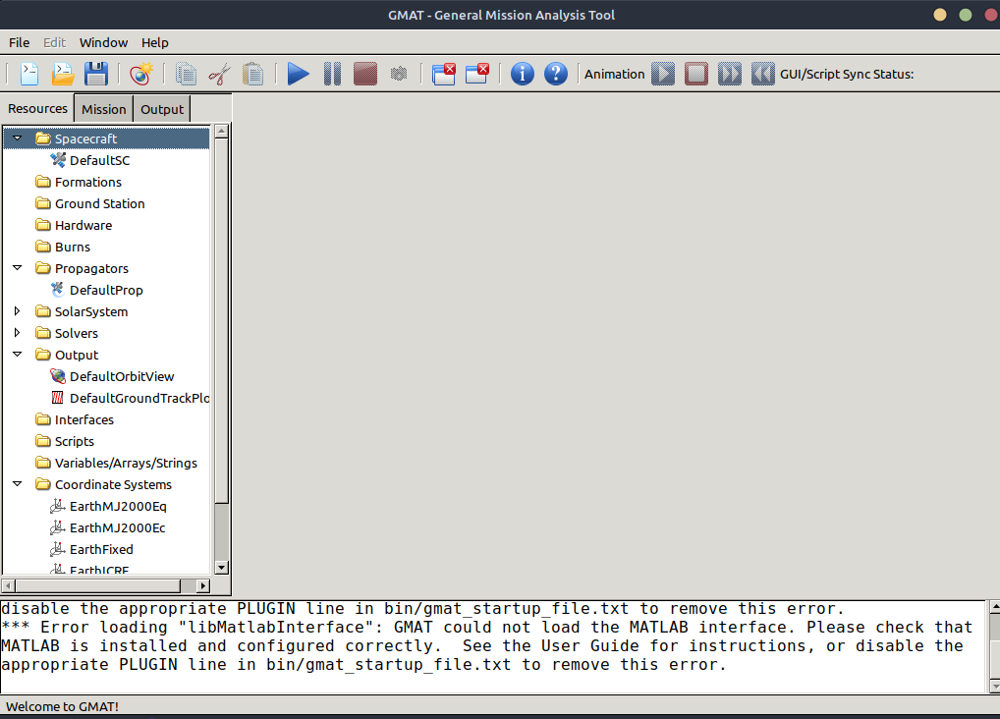
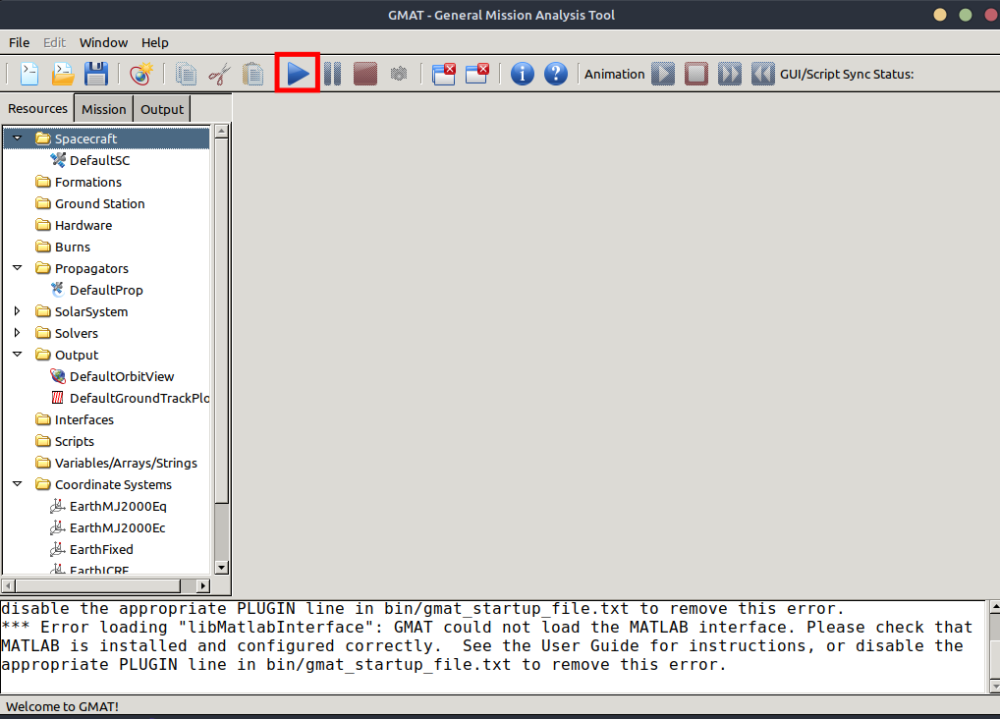
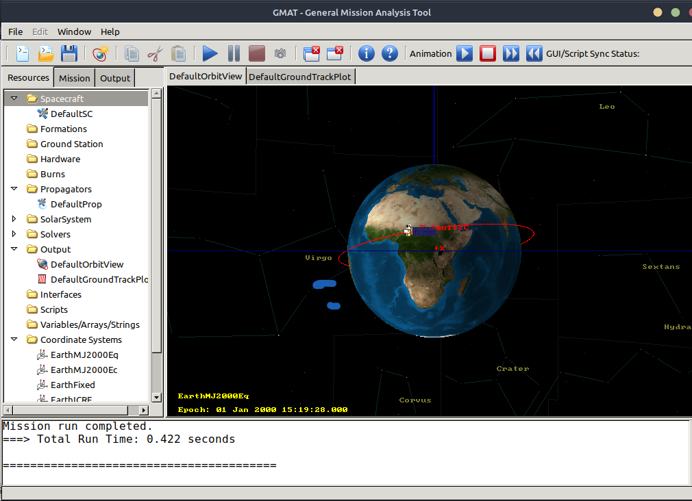

# GMAT en Agni

Agni B3V, como se menciona en la sección [Interfaz de Usuario](../gui/gui.md), provee un template de script de GMAT que contiene una misión por defecto, la cual puede ser adaptaba según las necesidades del usuario.

Al abrir GMAT desde la interfaz de usuario, se cargará la misión por defecto que trae el script y se verá la siguiente ventana:

En las secciones de "Resources", "Mission" y "Output" se podrán modificar las condiciones que sean necesarias. Se recomienda no modificar la ruta de salida de los archivos ni los archivos generados, ya que puede alterar el correcto funcionamiento de las siguientes etapas.

Una vez configurada la misión, se debe hacer click en el botón para correr la misión:

Al completarse la simulación, se podrá ver la órbita para poder validar visualmenta la correctitud de la órbita configurada.

Además, se generarán dos archivos de salida en la ruta del proyecto:

* `ReportFile.txt`: Incluye los datos de la órbita a lo largo del tiempo, como la posición del satélite y del sol con respecto a la tierra.
* `EclipseLocator.txt`: Contiene la información del momento en el que transcurre un eclipse y su duración.
