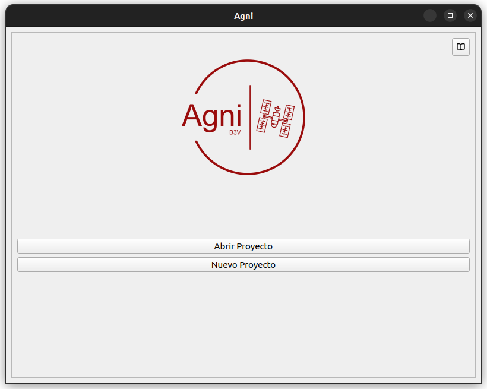
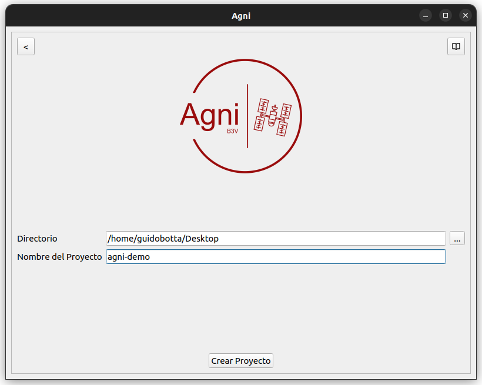
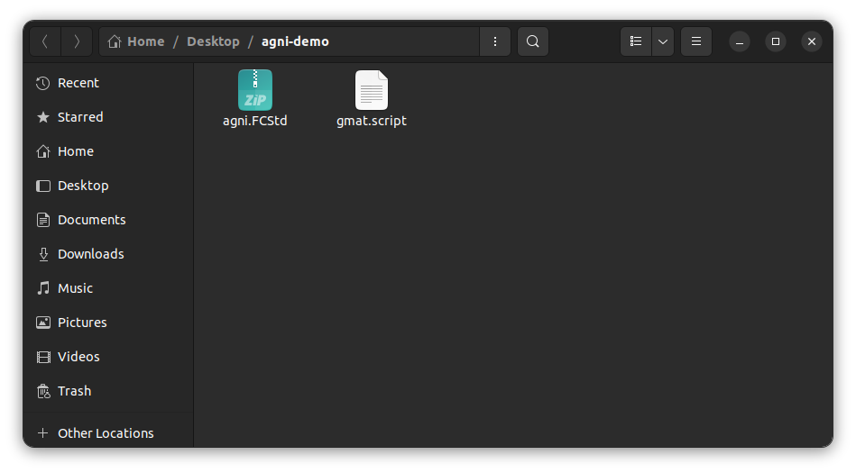
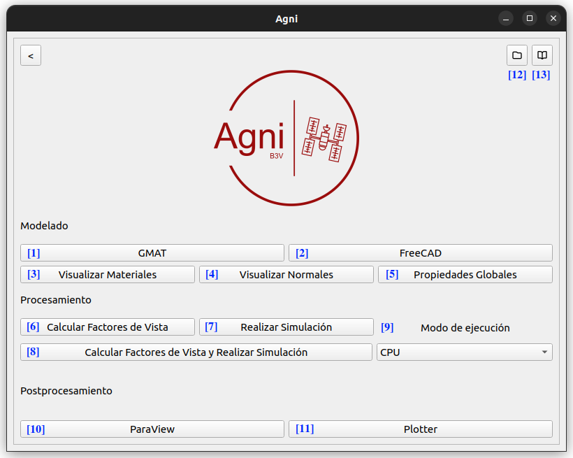

# Interfaz de Usuario

La interfaz de usuario permite la creación de proyectos y la utilización de las distintas herramientas del paquete. Al iniciar la aplicación, se abrirá la siguiente pantalla:

<i></i>

En esta se podrá seleccionar el directorio de un proyecto existente o crear uno nuevo. En caso de crear uno nuevo, se deberá seleccionar un directorio y completar el nombre del proyecto.

<i></i>

Al crear un nuevo proyecto, se creará un directorio con el nombre elegido en la carpeta seleccionada. Dentro de este nuevo directorio, se encontrarán dos templates que facilitarán la utilización de gmat y de freecad, como se puede ver en la siguiente pantalla.

<i></i>

* *agni.FCStd*: es un template de documento que facilita la utilización de freecad. Trae inicializada la configuración para agilizar la utilización del workbench.
* *gmat.script*: es un template de script que facilita la utilización de gmat. Trae por default una órbita  ya definida, que puede ser modificada desde GMAT. También trae configurado la generación de los archivos de salida `ReportFile.txt` y `EclipseLocator.txt`, que son necesarios para la ejecución del preprocesador.

Al abrir o crear un proyecto, nos encontraremos con la siguiente ventana:

<i></i>

- \[1\]: Abre GMAT con el script `gmat.script` cargado.
- \[2\]: Abre FreeCAD con el documento `agni.FCStd` cargado.
- \[3\]: Abre el visualizador de materiales. Requiere de los archivos `mesh.vtk` y `properties.json`, generados en FreeCAD.
- \[4\]: Abre el visualizador de normales. Requiere de los archivos `mesh.vtk` y `properties.json`, generados en FreeCAD.
- \[5\]: Abre la ventana de configuración de propiedades globales. Requiere del archivo `properties.json`, generado en FreeCAD.
- \[6\]: Ejecuta el preprocesador. Requiere de los archivos `mesh.vtk` y `properties.json`, generados en FreeCAD; y de los archivos `ReportFile.txt` y `EclipseLocator.txt`, generados en GMAT.
- \[7\]: Ejecuta el solver. Requiere de los archivos `mesh.vtk`, generado en FreeCAD; `view_factors.vf`, generado por el procesador; y `properties.json`, modificado por el preprocesador.
- \[8\]: Ejecuta el preprocesador y, al finalizar, ejecuta el solver. La ejecución de este comando bloquea por completo la utilización de la interfaz gráfica hasta la finalización de los procesos.
- \[9\]: Permite la selección del modo de ejecución entre CPU y GPU para la ejecución del solver.
- \[10\]: Abre ParaView con los resultados cargados. Requiere del directorio `/results`, generado por el solver.
- \[11\]: Abre el plotter con los resultados cargados. Requiere del directorio `/results`, generado por el solver.
- \[12\]: Abre el directorio del proyecto.
- \[13\]: Abre la documentación en una nueva pestaña del navegador predeterminado.
