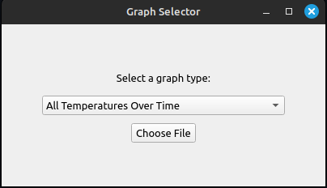
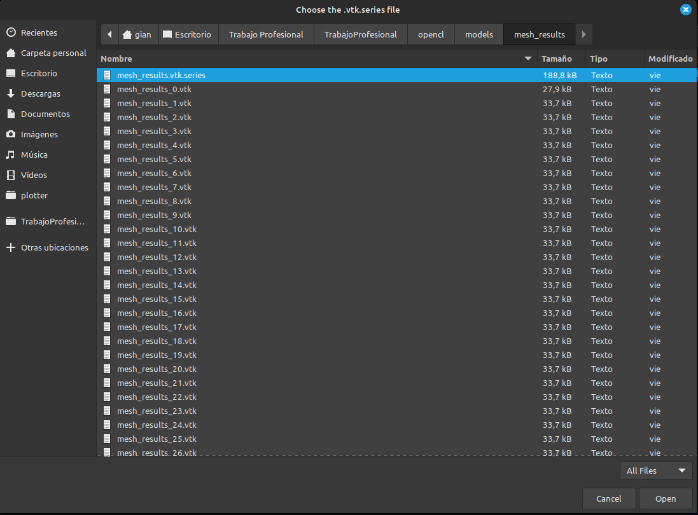
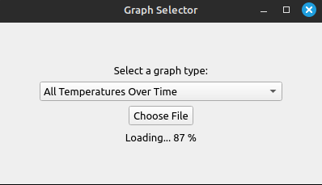
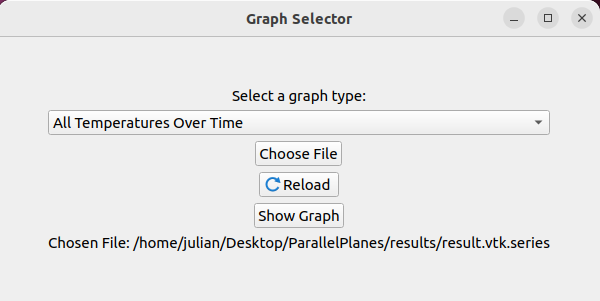
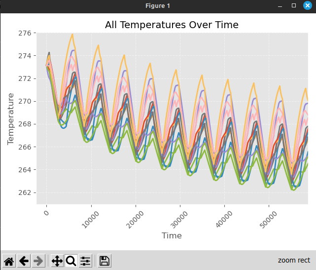
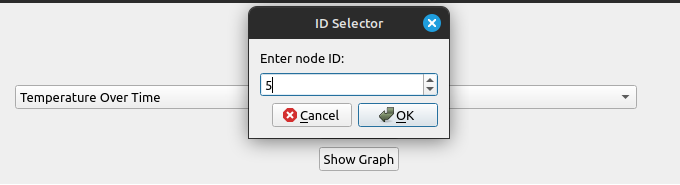
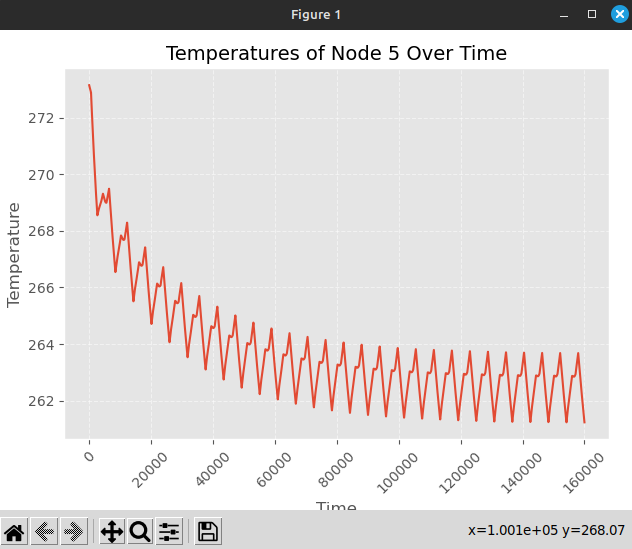
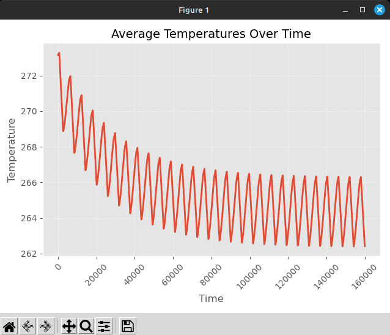
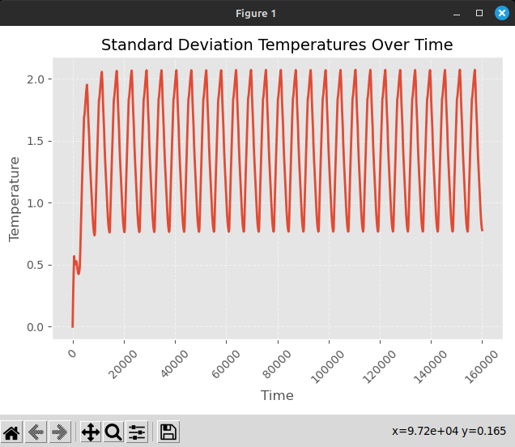

# Plotter

Al ejecutar el Plotter aparecerá la siguiente pantalla:

En la cual se podrá seleccionar el archivo .vtk.series deseado apretando en el boton Choose File

Esto abrirá un dialogo en el cual se puede seleccionar el archivo

Una vez seleccionado el programa cargará el archivo, dependiendo del tamaño del modelo y la cantidad de archivos generados puede llegar a demorar

Una vez cargado podemos observar si el path es correcto

Existen 4 graficos distintos que se pueden seleccionar, el primero, All Temperatures Over Time muestra un grafico de la temperatura en relacion al tiempo, con una linea para cada nodo

Luego, Temperature Over Time permite visualizar la de un solo nodo a elección, para lo cuál se debe indicar su ID, refesirse al manual de Paraview para obtener el ID de un nodo

El siguiente gráfico, Average Temperature Over Time muestra la temperatura promedio a través del tiempo

Por último, Standard Deviation Over Time muestra la desviación estándar a través del tiempo

