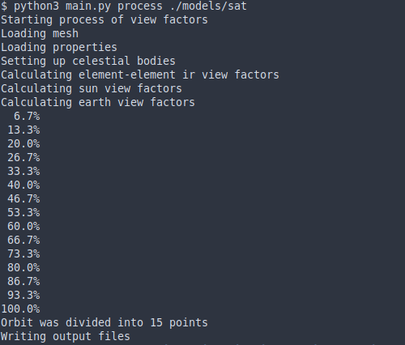
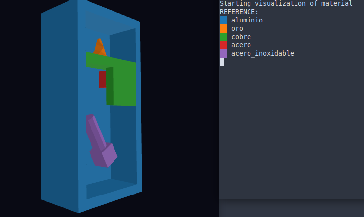
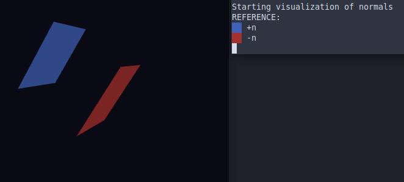

# Preprocesador


## Referencia rápida

Uso general

```
python3 main.py <operación> <directorio>
```

Donde operación define las tareas a realizar  y directorio es la carpeta en donde se buscarán los archivos requeridos.

Ejemplos:

```
python3 main.py process home/usuario/proyectos/satelite
python3 main.py process ./proyectos/satelite
python3 main.py viewm ./proyectos/satelite
python3 main.py viewn ./proyectos/satelite
```


## Estructura de properties.json

El archivo properties.json presenta tres secciones principales "global_properties", "materials" y "conditions"


### Propiedades globales

```
"global_properties": {
    "internal_emission": false,
    "element_ray_amount": 5000,
    "earth_ray_amount": 5000,
    "element_max_reflections_amount": 3,
    "orbit_divisions": 15,
}
```

* "internal_emmision" indica si por defecto deben considerarse la orientación de las caras del modelo al proyectar rayos elemento a elemento.
* "element_ray_amount" y "earth_ray_amount" establecen la cantidad de rayos a utilizar por elemento para radiación elemento-elemento y elemento-tierra (albedo e ir), respectivamente.
* "element_max_reflection_amount" es el límite de reflexiones  en radiación elemento a elemento.
* "orbit_divisions" establece la cantidad de puntos de la órbita a considerar, aunque es posible que se tomen menos puntos si los puntos de referencia que calcula GMAT se encuentran muy concentrados en algunas secciones.


### Materiales

```
"materials": {
    "properties": {
        "materialA": {
            "thermal_conductivity": 0.0,
            "specific_heat": 900.0,
            "density": 2700.0,
            "flux": 0.0,
            "thickness": 0.05,
            "alpha_sun": 1.0,
            "alpha_ir": 1.0,
            "initial_temperature": 273.15,
       }
       "materialB": { ... }
    },
    "elements": {
        "materialA": [0, 1, 2, 3, 4, 5, 6, 7, 8, 9, 10, 11]
        "materialB": [12, 13, 14, 15, 16, 17, 18, 19]
    }
}
```

Se divide en dos subsecciones.  "elements", en donde se indica un array con los ids de los elementos a los que correspondenen y "properties", donde se especifican las características físicas de los materiales:

* "thermal_conductivity": Conductividad térmica (\\( \frac{W}{m . K}\\)).
* "specific_heat": Calor específico (\\( \frac{J}{kg . K}\\)).
* "density": Densidad (\\( \frac{kg}{m^3}\\)).
* "thickness": Grosor (\\(m\\)).
* "alpha_sun": Absorptividad en frecuencias del espectro solar. Escalar positivo menor a uno.
* "alpha_ir": Absorptividad en el espectro infrarojo. Escalar positivo menor a uno.

### Conditions
```
"conditions": {
    "properties": {
        "conditionA": {
            "flux": 0.0,
            "initial_temperature": 273.15,
            "two_sides_emission": true,
       }
    },
    "elements": {
        "conditionA": [0, 1, 2, 3, 4, 5, 6, 7, 8, 9, 10, 11]
    }
}
```

Se divide en dos subsecciones.  "elements", en donde se indica un array con los ids de los elementos a los que correspondenen y "properties", donde se especifican las condiciones específicas:

* "flux": Flujo constante incidente (\\(W\\)).
* "initial_temperature": Temperatura inicial (\\(K\\)).
* "two_sides_emission": Indica si deben considerarse la orientación de las caras del modelo al proyectar rayos elemento a elemento.

## Procesamiento de factores de vista

**Archivos necesarios:** mesh.vtk, properties.json, ReportFile.txt, EclipseLocator.txt

Calcula factores de vista entre elementos del satélite, Tierra y el Sol.

<center></center>
<center><i> Ejecución de ejemplo de operación process </i></center>

Almacena los resultados en un archivo binario view_factors.vf.

## Visualización de materiales

**Archivos necesarios:** mesh.vtk, properties.json

Muestra en tres dimensiones los materiales asignados a cada elemento sobre el modelo.

<center></center>
<center><i> Ejecución de ejemplo de operación viewm </i></center>

## Visualización de orientación de normales

**Archivos necesarios:** mesh.vtk

Muestra en tres dimensiones la orientación (dirección de la normal) de cada elemento sobre el modelo.

<center></center>
<center><i> Ejecución de ejemplo de operación viewn </i></center>
